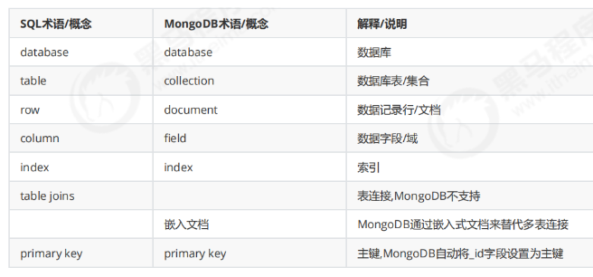

## 结构




## 一、安装MongoDB

### 1.1 下载MongoDB
1. 前往 [MongoDB 官方下载页面](https://www.mongodb.com/try/download/community)。
2. 选择适合你的操作系统（Windows、macOS 或 Linux）的版本。
3. 下载并安装 MongoDB Community Server。

### 1.2 安装步骤
- **Windows**：
  1. 下载后，运行安装程序，按提示完成安装。
  2. 安装时选择“Complete Setup”以获得所有组件。
  3. 如果希望MongoDB服务开机自动启动，选择“Install MongoDB as a Service”。
  
- **macOS**：
  1. 可以使用 [Homebrew](https://brew.sh/) 进行安装，执行命令：
     ```bash
     brew tap mongodb/brew
     brew install mongodb-community@6.0
     ```
  2. 安装完成后，可以用 `brew services start mongodb/brew/mongodb-community` 启动MongoDB服务。

- **Linux**：
  1. 使用包管理器安装MongoDB（如Ubuntu的 `apt` 或CentOS的 `yum`）。
  2. 参考官方文档 [MongoDB Installation on Linux](https://docs.mongodb.com/manual/administration/install-on-linux/) 获取详细指引。

### 1.3 启动MongoDB
- 在终端或命令提示符中运行以下命令启动MongoDB服务：
  ```bash
  mongod
  ```
- 默认情况下，MongoDB监听`27017`端口，可以通过浏览器访问 `http://localhost:27017` 进行连接检查（此页面仅显示连接成功信息）。

---

## 二、MongoDB Shell 基本使用

### 2.1 连接到MongoDB
- 在终端中输入以下命令，启动MongoDB的Shell（`mongosh`是新版的MongoDB命令行工具）：
  ```bash
  mongosh
  ```
- 默认会连接到本地MongoDB服务。如果成功，将会进入交互式MongoDB Shell。

### 2.2 常用命令

- **查看所有数据库**：
  ```javascript
  show dbs
  ```
- **创建或切换到数据库**：
  ```javascript
  use myDatabase
  ```
  如果数据库 `myDatabase` 不存在，这条命令会创建它。
  
- **查看当前数据库的集合**：
  ```javascript
  show collections
  ```

- **插入数据**：
  ```javascript
  db.myCollection.insertOne({ name: "Alice", age: 25, city: "New York" })
  ```
  以上命令会在 `myCollection` 中插入一条数据。

- **查询数据**：
  ```javascript
  db.myCollection.find()
  ```
  此命令会显示集合中的所有文档。

- **更新数据**：
  ```javascript
  db.myCollection.updateOne(
    { name: "Alice" },
    { $set: { age: 26 } }
  )
  ```
  这条命令会将 `name` 为 "Alice" 的文档中的 `age` 字段更新为26。

- **删除数据**：
  ```javascript
  db.myCollection.deleteOne({ name: "Alice" })
  ```
  删除 `name` 为 "Alice" 的文档。

- **删除集合**：
  ```javascript
  db.myCollection.drop()
  ```

- **删除数据库**：
  ```javascript
  db.dropDatabase()
  ```

---

## 三、MongoDB 基本操作示例

以下是一些更详细的操作示例：

### 3.1 插入多个文档
可以一次性插入多个文档到集合中：
```javascript
db.users.insertMany([
  { name: "John", age: 30, city: "Los Angeles" },
  { name: "Jane", age: 27, city: "Chicago" },
  { name: "Mike", age: 32, city: "Houston" }
])
```

### 3.2 条件查询
查找符合条件的数据，例如查找年龄大于28的用户：
```javascript
db.users.find({ age: { $gt: 28 } })
```

### 3.3 数据排序
对查询结果进行排序，例如按年龄降序排序：
```javascript
db.users.find().sort({ age: -1 })
```

### 3.4 数据分页
通过 `limit` 和 `skip` 实现分页查询，例如返回第2页的两条数据：
```javascript
db.users.find().skip(2).limit(2)
```

### 3.5 索引
为字段创建索引以加快查询速度。例如，为 `name` 字段创建索引：
```javascript
db.users.createIndex({ name: 1 })
```

### 3.6 聚合查询
通过聚合管道查询，例如按城市统计用户数量：
```javascript
db.users.aggregate([
  { $group: { _id: "$city", count: { $sum: 1 } } }
])
```

---

## 四、使用 MongoDB Compass 图形化界面（可选）

MongoDB Compass 是 MongoDB 提供的官方图形化管理工具，可以通过它更方便地管理数据库：

1. 前往 [MongoDB Compass 下载页面](https://www.mongodb.com/try/download/compass) 下载安装。
2. 打开 Compass，并连接到 MongoDB 服务器（本地服务器可以直接使用 `localhost:27017`）。
3. 使用Compass的图形界面，可以查看数据库、集合，插入数据，查询数据等。

---

## 五、使用 MongoDB Atlas 云数据库（可选）

MongoDB Atlas 是 MongoDB 的云数据库服务，可以直接在云端创建、管理和使用数据库，适合不想在本地安装 MongoDB 的用户。

1. 前往 [MongoDB Atlas 官网](https://www.mongodb.com/cloud/atlas) 并注册账户。
2. 创建一个新的数据库集群，设置连接用户和密码。
3. 使用 MongoDB Atlas 提供的连接字符串连接到数据库，可以在本地或者应用程序中访问。

---

通过上述步骤，你可以完成MongoDB的基本安装和使用。希望这些内容能帮助你更好地理解和操作MongoDB。