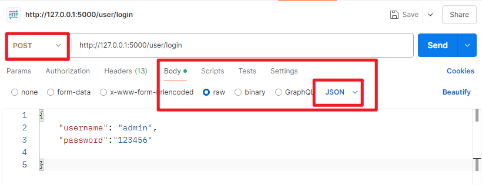

## 怎么发送 json 类型的数据
 
在 Postman 中发送 JSON 类型的数据是非常简单的，以下是详细的步骤：



### 1. **打开 Postman 并创建一个新的请求**
- 启动 Postman 应用。
- 点击左上角的 **"New"** 按钮，选择 **"Request"**。
- 在弹出的窗口中，给你的请求命名并选择一个合适的集合（Collection）来保存请求。

### 2. **设置请求类型为 POST 或 PUT**
- 在请求窗口的左侧，有一个下拉框，默认值是 **GET**。点击它并选择 **POST** 或 **PUT**，这通常是发送数据时使用的请求方法。
- 如果你需要向某个 API 发送数据，通常是 POST 或 PUT。

### 3. **设置请求头（Headers）**
- 在请求窗口中，切换到 **Headers** 标签。
- 在 **Key** 列中输入 `Content-Type`，在 **Value** 列中输入 `application/json`。这样，Postman 会告诉服务器，你发送的数据是 JSON 格式。
  
  示例：
  ```
  Key: Content-Type
  Value: application/json
  ```

### 4. **在 Body 中添加 JSON 数据**
- 切换到 **Body** 标签。
- 选择 **raw** 选项，然后在右侧的下拉框中选择 **JSON**。这将告诉 Postman 你要发送的是 JSON 格式的数据。
  
  示例：
  ```
  {
    "name": "John Doe",
    "email": "john.doe@example.com",
    "age": 30
  }
  ```

### 5. **发送请求**
- 在输入完 JSON 数据后，点击 **Send** 按钮，Postman 会将请求发送到你指定的 URL，并显示响应结果。

### 完整的流程：
1. **选择请求类型**（POST/PUT）。
2. **设置请求头**：`Content-Type: application/json`。
3. **在 Body 中输入 JSON 数据**。
4. **点击 Send 发送请求**。

### 例子：

假设你要发送以下 JSON 数据到某个 API：

```json
{
  "username": "testuser",
  "password": "mypassword"
}
```

#### 在 Postman 中：
- **Method**：POST
- **Headers**：
  ```
  Key: Content-Type
  Value: application/json
  ```
- **Body**：
  ```
  {
    "username": "testuser",
    "password": "mypassword"
  }
  ```

通过这个流程，你就能够向服务器发送 JSON 格式的数据了。