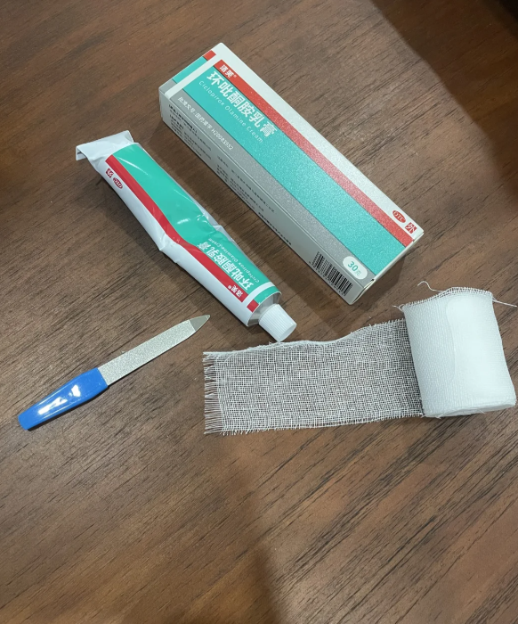
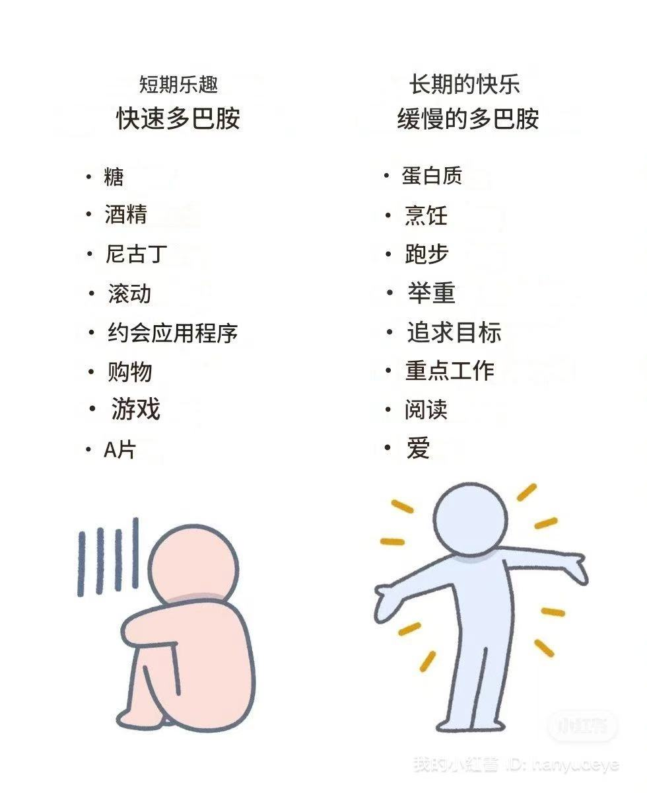

# 寄快递

如果是给朋友寄快递，你在闲鱼随便发布一个商品链接，让朋友拍下，然后从闲鱼给朋友发货，闲鱼寄快递会有五六块钱补贴，比如我发中通和圆通就是5元，发顺丰和京东是14元，而且可以从闲鱼直接看到物流信息，一举两得！

# 一个购买便宜机票的技巧

网上有很多博主都提过，利用买长坐短购买到更低价格的机票。

比如你从 A 飞到 B，你可以先看看 A 到 B 到 C 的机票，可能会更便宜，然后在 B 的时候，下飞机、退 B 到 C 的票。

举个实际的例子：8月4日，我要从北京飞上海，某程最低的价格是 800 元；但是我搜到北京去上海中转，再飞厦门，一共只需要 650 元。 我飞到上海之后，就离开机场，这样只花了 650 就可以到我们的目的地。

但是有个问题，怎么去搜中转城市呢？

这就是今天要说的重点，有的人是找临近城市，一个一个搜；有的人是利用飞常准的航线图，缩小搜索范围。

我在研究这个 BUG 的时候，发现了一个微信小程序「惠飞助手」，选择 A 和 B ，会自动出来很多 C，然后再去某程上搜索 A 到 C 的航班，比较价格，这样就能买到更便宜的机票。

# 委婉拒绝别人的万能借口！

那天心血来潮去做指甲，因为我不爱留指甲，就短指甲做纯色，美甲师疯狂推荐我说贴甲片多好看多好看，我灵机一动说“不行诶，算命的说我不能接假发假指甲，影响运气。”（这是真的，之前看手相师傅建议我留自己指甲，不要贴假指甲，我是由此得出这个万能借口哈哈哈）

后来我把这个当故事讲给我朋友，她下午要去剪头发，我说你试试，如果要办卡，就说“算命的说我今年小心破财，不适合办卡，理财，充值会员。。。。”（之前我说直接拒绝说没钱办卡，对方延伸到你做什么工作，工作多久，很烦。。）

感觉这是一个很好用的借口，大家可以试试，对于一些普通朋友这个借口很万能！

# 常见合同模板的官方下载渠道

今天在小红书看到卖合同电子版的，15块钱一份，卖了一千单。
我就纳闷，这不都是免费的？
因为国家市监局就提供了很多合同模板，常见的房屋出租，合同买卖，二手车交易，装修合同之类的都有，基本上所有合同都包含了，而且还根据每个省详细归类，Word和PDF模板均可无需注册免费下载。
网址：https://htsfwb.samr.gov.cn/

# 挑选牙膏

贵或者便宜无所谓，牙膏最主要的是水合硅石+氟（含氟可以预防蛀牙，但是不能一直用）

不要买有碳酸钙的，这个伤害牙釉质

晚上一定要用高氟牙膏（泡沫含一会儿），白天可以用无氟或者低氟的（氟在下巴会长痘，要冲干净）

用完一支要换个品牌，牙齿会耐受

# 吉尔丹快干短袖
推荐平台：淘宝
吉尔丹BI00，15块钱一件。
每年夏天买个四件的换着穿。
质量好，性价比拉满

站长实测：已经购买，目前看了看商品评价，确实性价比和质量优秀。唯一缺点就是现在马上就要秋冬天了！知道的太迟了...

这里放上淘宝链接，因为我发现拼多多搜索吉尔丹好像有假货（拼多多无官方店，且两平台价格都一样差不多），另外一个链接是吉尔丹的纯棉T恤，感觉也不错。

快干：http://e.tb.cn/h.gp1f0QJSPvbtPyM?tk=VHVz3TlCc1o

纯棉：http://e.tb.cn/h.goCQtAVM37XcEdh?tk=Ytix3TlDuqP

# 新农奶粉
因为每天早上都自己冲奶粉喝，所以做过所有奶制品牌的攻略。只推荐一款品牌：新农，新疆本地的品牌。新农真的是我喝过奶味最浓的纯牛奶了！配料表只有生牛乳，加热后放一会儿就会有奶皮子。
而且新农乳业（人家居然是上市公司）是新疆唯一一个不收购散户奶源的乳企业！新农冰川牧场在远离污染源的900KM以外，连土壤，牧草，冰川水都无污染的，那养出来的奶牛自然是杠杠！牛奶品质很有保障！
缺点：假货太多！只要不是新疆发出来的肯定是假货！

# 话费套餐经济实用的参考

第一,把主卡换成8元保号套餐
第二,买一个流量卡使用,记住不要相信低于19块,高于200g的流量卡！！普遍是29块,120g左右,各个运营商有不同,大差不差
开卡前记得咨询一下运营商,具体话费是多少,是不是长期套餐,销卡有没有什么限制等等问清楚再开卡

文内有个误区，但是方法是对了，19元一年或者2年包100分钟通话，100-160g流量 ，8月份因为竞合，都限制再80g，这个月有大流量套餐了，不需要100分钟通话的，流量确实19元200g左右，但不是长期卡1-2年的卡，反正有8元的主卡，19元只是为了买流量，1-2年换一次卡也是可以的

# 缓解视力

适当休息：遵循20-20-20法则：每使用电子设备20分钟，抬头看20英尺（6米）远的地方至少20秒，这样有助于放松眼睛。

# 获取非常快的百度网盘速度

百度网盘免费解除部分限速（部分用户因为网络供应商可能失败）。在百度网盘设置里面有传输一栏，点击后点击优化速率，用上行带宽换取下行带宽，不用的时候关闭即可。这样可以从几十kb的传输到2~3mb,个人感觉传输速度提升挺大。

# 购物和生活建议

1.  买油执行标准区别  
    推荐标准：GB/T 2716（调和油）、GB/T 1534（花生油）、GB/T 1535（大豆油）、GB/T 1536（菜籽油）、GB/T 19111（玉米油）、GB/T 10464（葵花籽油）。
2.  买米执行标准区别  
    推荐标准：GB/T 1354（普通大米）、GB/T 19266（五常大米）、GB/T 18824（盘锦大米）、GB/T 20040（方正大米）、GB/T 22438（原阳大米）。  
    普通米：四位数为普通米，五位数为优质米。
3.  买口罩执行标准  
    医药行业标准：YY0469、YY/T0969。  
    洗衣液标准：QB/T 1224。
4.  买牙膏执行标准  
    牙齿发黄：水合硅石成分。  
    抑菌减轻炎症：生育酚乙酸酯、丁香酚。  
    敏感牙齿：硝酸钾和锶盐。  
    增白：焦磷酸盐。  
    口腔溃疡：避免月桂醇硫酸酯钠（SLS）。  
    建议：三个月换一次不同功效的牙膏，避免细菌耐药性。
5.  买卫生巾标准  
    不能买：香味款（含防腐剂）、清凉款（痛上加痛）、原料中有绒毛浆（大部分为二次回收）。  
    可以买：执行标准编码GB15979、GBT8939。
6.  买酒执行标准  
    推荐标准：GB/T 26760-2011（酱香型）、GB/T 10781.1-2006（浓香型）、GB/T 10781.2-2006（清香型）、GB/T 10781.3-2006（米香型）、GB/T 26761（小曲固态发酵）、GB/T 20822（固液法）、GB/T 20821-2007（液态法）。  
    检验法：GB107为标准，GB208为酒精勾兑（茅台除外）。
7.  买水果标准  
    苹果：买表面有条纹的，不买带点的。  
    芒果：买瘦的，不买胖的。  
    菠萝：买矮胖的，不要瘦长的。  
    榴莲：买圆的，不买长的。  
    西瓜：买瓜屁股眼小的，不买眼大的。  
    橙子：买母不买公（眼为肚脐状）。  
    火龙果：买胖不买瘦。  
    香蕉：带芝麻点的（更甜）。
8.  买火腿肠标准  
    无淀粉火腿肠：淀粉含量≤1%，口感最好。  
    特级火腿肠：淀粉含量≤6%。  
    优秀火腿：淀粉含量≤8%。  
    普通火腿：淀粉含量≤10%。  
    国家标准：GB/T 20712。  
    行业标准：GB/T 10279。  
    建议：选择钠含量低的。
9.  脚臭怎么办  
    方法：每天用盆洗脚，倒入20ml碘伏，泡10分钟，泡完脚后把鞋垫和袜子也放入盆中泡一泡，换双新鞋垫，把甲硝唑研成末放在鞋垫上，坚持一周脚不臭。
10.  买洗衣液执行标准  
    标准：GB/T 1224，活性物含量达到推荐标准，有效除污渍，还可以香香的。
11.  购买纸巾注意  
    高版本：原生木浆（家用餐巾纸）。  
    中版本：原生浆或纯木浆（一般）。  
    最低版本：混合浆（最低版）。

## 净水器滤芯多久换一次

PP棉一般是3个月，活性炭一般是6个月，超滤膜一般是12个月，RO膜滤芯一般是24个月

## 怎么判断电池剩余电量？

把电池距离桌面三五公分左右垂直松手放下，没电的电池会弹起来，有电的会垂直落下

## 板栗快速剥皮

市场的板栗去壳没去皮。买回来直接放冰箱冷冻半小时以上，或者直接放到要煮再拿出来。
锅烧开水，板栗从冰冻层拿出来直接放开水锅里煮两分钟。放凉就可以剥皮了，先剥底部更好剥皮，有的在开水里晃一晃，皮就直接掉出来了。

## 酒店防偷拍指南

进门关灯拉窗帘，尽量让室内全黑

仔细观察：插座孔/路由器/床头灯/烟感器/空调口/挂衣钩/窗帘顶部等地方，是否有红点

若有红点，可能是摄像头的夜视红外灯（一闪一闪的是正常的烟感器，如果是摄像头，红灯会常亮）

## 电商经验

每天来收件的快递小哥，我时不时给一包烟，每次来我只要在都会给红牛！只要他收的快递哪一家爆单了，他都能拍产品给我看，问我要不要跟做。算是一个小小的人情世故经验，不过这个方法真的让我吃到两次红利产品。

## 电饭锅

电饭锅不要买那些拿涂层不粘锅之类作为噱头，或者0涂层黑科技之类的。
坐标广东某地，全国三分之一的电饭锅都是我这边生产的，就买那种老式无涂层的，比如三角牌或者半球，五六十块钱，这种老式不带涂层的最健康也更耐用，煮饭时间都可以缩短一半，清洁无死角，只是外观淘汰了而已，别质疑我的专业。

## 一个人无聊可以做什么？
1 逛寺庙（很适合静心）
<<<<<<< HEAD:吃喝/生活小技巧.md
2 天气好的话去公园放风
3 去一家没去过的书店
4 穿上运动鞋爬山
5 打卡各类博物馆
6 喜欢 DIY 的话去尝试陶艺
7 逛花鸟市场（买一盆可爱的盆栽）
8 找一家别致的咖啡店发呆
9 看一场电影
10 去花店给自己买一束花插在房间或客厅

## 买水

冰露，性价比高，在社区电商多多买菜，美团优选，兴盛优选这些平台，这个水都是 9.99 或者 10.09，今天买明天到，自提点一般就在小区楼下

## 手表电池

CR2016 纽扣电池
=======
2 天气好的话去公园放风3 ，去一家没去过的书店4 ．穿上运动鞋爬山5 ，打卡各类博物馆&喜欢 DIY 的话去尝试陶艺7 ．逛花鸟市场（买一盆可爱的盆栽）&找一家别致的咖啡店发呆9 法看一场电影10 ．去花店给自己买一束花插在房间或客厅

## 治疗灰指甲

先说成本：洛芙环吡酮胺乳膏30元 纱布3元 锉刀0元 合计33元

使用方法：洗完澡趁趾甲比较软的时候挫甲，从远端一点一点往里锉，自己锉是比较好掌握力度的，也不会弄疼。然后厚涂上药膏，用纱布缠3圈，也不要缠太厚，不透气，打个活结，就可以睡觉了，其实还是非常简单的
效果：使用2周左右，感觉坏甲在慢慢脱落，自己可以用锉刀很容易就锉掉，现在就慢慢等新的指甲长出来，完全替换掉旧甲之后就才是治好了，坚持用。

## 摆脱刷抖音

刷抖音时，刷到的都是毫无逻辑的刺激性信息，这种短且强刺激信息大脑是没办法捋顺的，于是大脑就会放弃深度思考的尝试，选择被动接受碎片化的信息刺激就行了，说的通俗点，就是你的大脑躺平了，抖音就会接管你的大脑让你麻木的刷下一个，下一个，下一个。

下载抖音精选版，里面得质量比抖音高很多，没有乱七八糟的直播卖货，狗血短剧。

## 去加油站加油前，先领领券

推荐平台：抖音、高德等
现在有很多加油站都有推广的活动，有各种各样的加油折扣券。
油站自己的公众号优惠

## 使人长久快乐的习惯

>>>>>>> a98b47ee7fa0a9dd14df856a1b6eaf8b14f21e13:吃喝玩乐/生活小技巧.md
