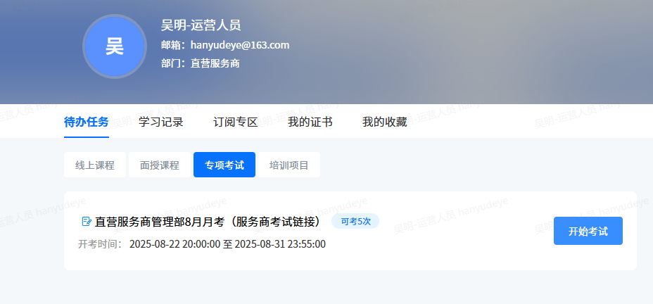

todo: 数据科学怎么学

考试，截图题目答案

todo : 一周发一个广告，
信息不要看太多。

- 创建 postman 快捷键

- 照相，洗照片

todo: 港币国内使用
小额的 Bocpay，支持云闪付，直接中银香港登录
todo: ZA银行绑卡，转账 ，绑微信香港钱宝
todo: 打 中银电话

todo: 日语考试，命运的齿轮在转动 [9月开始]
- 购买新的苹果手机，能用吗(卡不同)

## 目标
设置清晰的目标，不设置没法达标，拼了命达标，昭告天下，别人都会给你让路

比如减肥:2个月10斤

