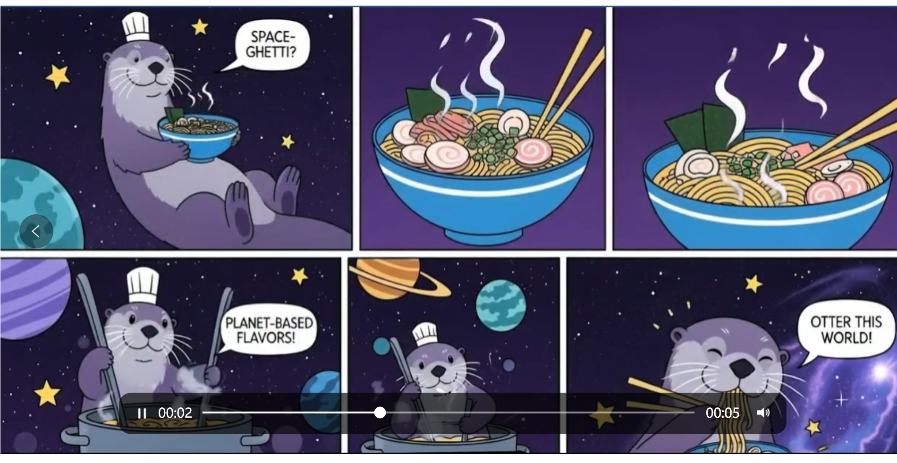

> 注意要点 : 需求第一 

创业就是角斗士赛场，很危险，但回报丰厚。而就业容易但回报低。所以创业要年轻。
投资收益很低
靠品牌要不要好点

# 生意的本质，商业的本质  [信任交换]

1. 人不要自己生产所有自己需要的东西
2. 建立的一种交换 就是 信用的交换
3. 要注意，购买东西要了解 东西的其他信息，才能建立信用基础

# 注意点

开门做生意，要注意 品质，环境，形象；不能像家里一样

# 复制

其中一个区别是劳动成果是否可以复制。农产品、工业品、面对面的服务都不能复制，而技术、设计、创意、文化产品可以。

不能复制，投入产出就是线性的；可以复制，产出理论上就没有上限

# 项目

电子产品好卖，关注 文案 主图 价格

# 未来20年能投资的行业和企业

## 未来20年值得关注的投资方向

### 1. **人工智能与自动化**
**趋势**：AI将像互联网一样渗透所有行业。

- **投资逻辑**：生产效率提升、AI模型和芯片需求暴涨。
- **代表公司**：
  - 🇺🇸 **Nvidia（英伟达）**：AI芯片龙头。
  - 🇨🇳 **寒武纪、海光信息**：国产AI芯片代表。
  - 🇺🇸 **OpenAI、Anthropic、Palantir**：AI模型/数据智能。
  - 🇨🇳 **百度（文心一言）**、**阿里**、**字节跳动**：大模型探索者。

### 2. **新能源与碳中和**
**趋势**：全球2050碳中和目标倒逼能源结构转型。

- **投资逻辑**：从化石能源向光伏、风电、储能、电动车过渡。
- **代表公司**：
  - 🇺🇸 **Tesla、NextEra Energy、Enphase Energy**。
  - 🇩🇪 **Siemens Gamesa（风电）**。

### 3. **半导体产业链**
**趋势**：国产替代 & 全球高端芯片供需紧张。

- **投资逻辑**：制造能力、安全自主、AI算力驱动。
- **代表公司**：
  - 🇺🇸 **台积电、ASML、英特尔、AMD**。

### 4. **医疗健康与生物科技**
**趋势**：老龄化+医疗技术革新+基因疗法兴起。

- **投资逻辑**：长寿经济、精准医疗、AI辅助诊疗。
- **代表公司**：
  - 🇺🇸 **Pfizer、Moderna、Illumina、Johnson & Johnson**。

### 5. **高端制造与航天军工**
**趋势**：产业升级、国产化替代、军工现代化。

- **代表公司**：
  - 🇺🇸 **Lockheed Martin、SpaceX（未上市）、Raytheon**。

### 6. **数据基础设施与云计算**
**趋势**：数据就是新“石油”，算力是新“电力”。

- **投资逻辑**：企业数字化转型、AI推理训练需求爆发。
- **代表公司**：
  - 🇺🇸 **Amazon (AWS)、Microsoft (Azure)、Google (GCP)**。

### 7. **消费升级 & 老年经济**
**趋势**：新中产崛起，老龄人口激增。

- **方向细分**：
  - 高端养老服务
  - 康养地产
  - 医疗器械
  - 营养保健品（如汤臣倍健、合生元）
  - 高端消费品与体验型消费（如茅台、酱酒、宠物经济）

## 投资建议

- **核心仓位**：集中在大趋势支撑的核心行业。
- **卫星仓位**：可以少量配置风险高、爆发性强的创新公司。
- **分散+定投+长期持有**：应对波动和周期风险。
- **关注政策与监管环境**：特别是科技和能源类企业。

# 商业

需求，永远是商业成功的第一步。成功的商业都是拿着需求找技术方案。

人性追求简单，但 复杂是逆人性，更能挣钱

## 产品前传

腾讯最初想做的是 BB 机，之后却靠即时通讯成了名

马云创业最初做的是“中国黄页”

刘强东最初就是个卖盗版光碟的，开店花光了他全部的积蓄

周鸿祎最初做的是 3721“流氓”软件和中文域名业务

扎克伯格在创立 Facebook 时只是为了约校园内单身的妹子

滴滴程维在公司初创时，需要给每个司机发传单讲解如何使用滴滴，还要教他们安装，终于在一个大雪天滴滴用户数突破了 1000。

耐克最初并不叫耐克，也不自己做鞋，只是做个代理商赚差价。

