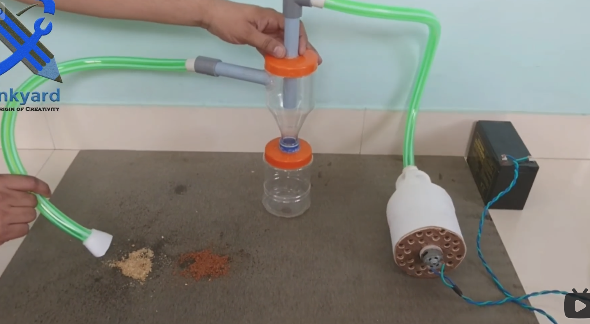

## 马斯克 

被誉为 “钢铁侠”

## 张忠谋

## 李光耀

空调，新加坡

## 村上春树

跑步可以磨砺人的身体，也可以让人的心灵变得粗粝和坚强。一个能够常年跑步的人，往往在另一个领域也会充满韧性。

## 原研哉《棍子和碗》

万事万物，或 研究某个 东西，一是研究它的本质，一是研究它的周边关系

> 给小米LOGO 倒圆角的日本设计师

## 罗杰·彭罗斯
Roger Penrose: I don't believe it is consciousness that collapses the wave function, instead it's the collapse of the wave functions that produces consciousness
我不相信是意识坍缩了波函数，而是波函数的坍缩产生了意识

## 戴森

戴森 设计了气旋式吸尘器，让尘土颗粒不会吸入到风道中，而是被离心力甩到了尘盒中，这样风道就不会被灰尘阻塞了

## J. Money

财富 = 拥有 - 想要

