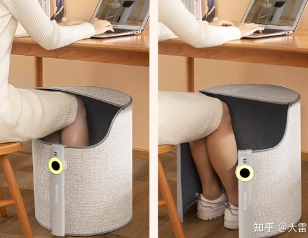
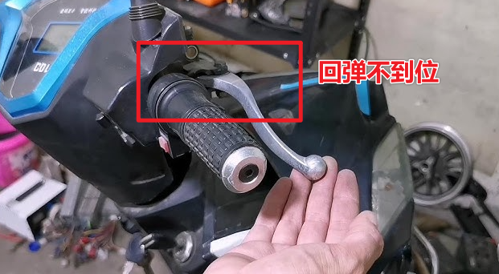
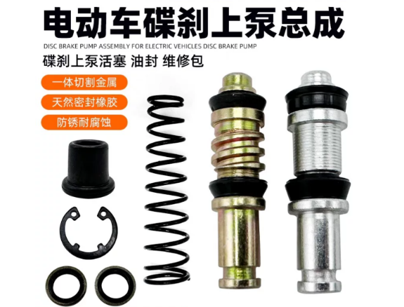
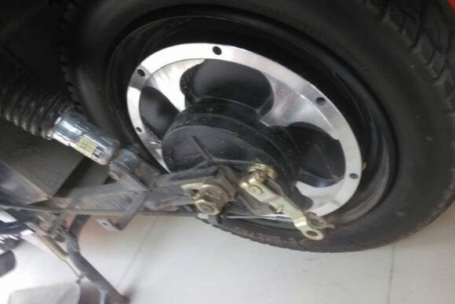
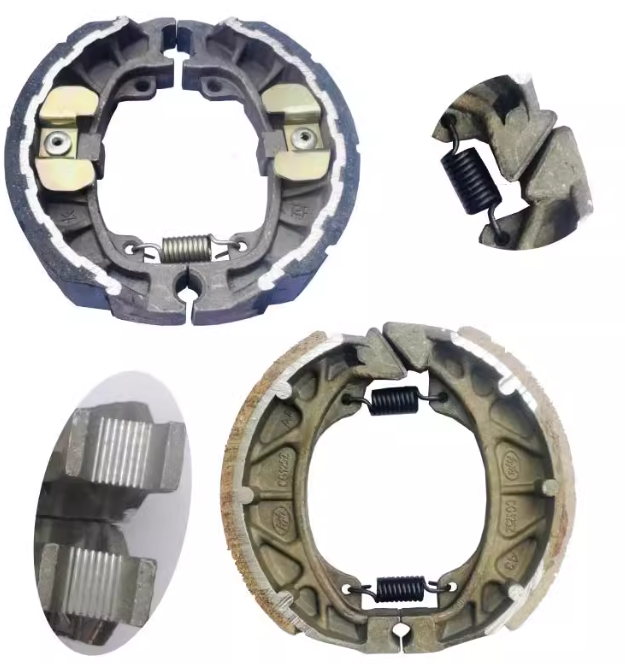
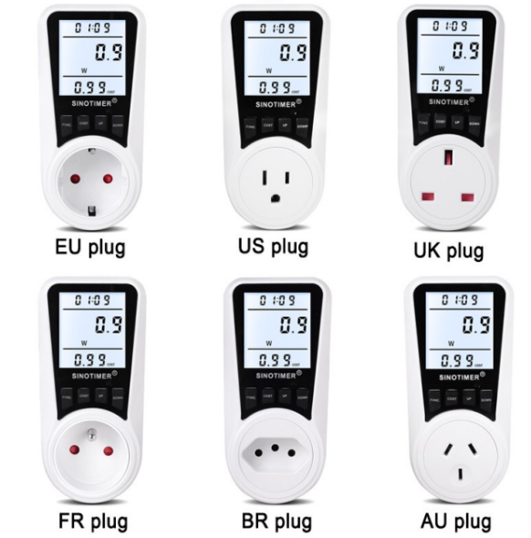

## 冬季保暖捂脚

这种上面有盖子的暖脚神器，可以持续维持温度，在办公时使用很不错

> 缺点是热量散发会感觉不热，可以用毛巾盖住漏风的地方，温度会提升很多。

# 电动车维修

## 刹车液压泵弹起障碍

此障碍一般是刹车回弹液压里面有堵塞或者弹簧失去弹性，可以更换套件.
> 量尺寸时要先进行拆卸，注意油脂滴落洒到衣服上。

## 更换鼓刹刹车盘

鼓刹电动车刹车平稳，但容易磨损，一般1年后会失效，是易耗物，可以进行更换。

购买配件不知道尺寸时，可以拍照联系客服，客服会提供准确尺寸。

## 电动自行车如何解除P档

1. **拧动油门 + 捏刹车组合键**

   * 某些车型要求在安全状态下（刹车按住）拧动油门，同时长按 P 或模式键，解除驻车。

2. **转动钥匙到“ON”并短按解锁键**

   * 有的车型防盗系统与 P 档绑定，需要解锁防盗后才能解除。

## 统计功率的插座 [功率计量插座]

