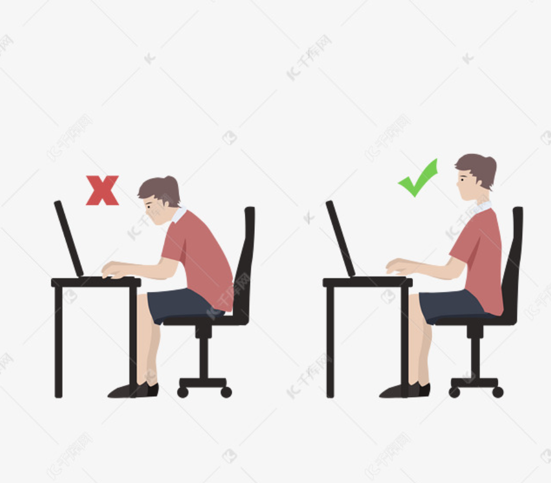

> 简单的喜欢最长远，平凡的陪伴最心安，懂你的人最温暖

# 关系
## 家庭

父母的世界很小，小到只裝滿了子女；而子女的世界很大，大到可以忽略父母的存在。

别再抱怨说我有多么不幸的家世，以及饱含期盼的父母，富二代、官二代的父母也没有不抱期待。 关键是，倘若你觉得自己家境平庸、父母懦弱，就努力狠下心带领全家走向发家致富的新道路，好吗？ 与其埋怨他们给不了你什么，不如想想自己长到二、三十几岁给过他们什么。

## 亲戚

姑妈,姑父  西园1村 23幢 105 

孙家奶奶

蒋家奶奶，爷爷

## 村里人关系

刚刚妈

飞飞妈

海海妈

满林，富林

等等

## 同学

阿明瓜子

# 健康

## 快速睡觉，睡眠

使用冥想

## 修行

1. 洗冷水澡
2. 肌肉力量锻炼

## 减肥
https://www.nia.nih.gov/news/timeframe-8-hour-restricted-eating-irrelevant-weight-loss
一项研究提出，每天的进食时间限制在8小时之内，其他16小时不进食，有利于肥胖者减肥，改善健康。

健康的烹饪方式： 蒸、煮、烤、拌，少用炒，油。

## 处方药 和 非处方药 

处方药： 需要凭医生开具的处方才能购买和使用的药物。
非处方药： 无需医生处方，可以在药店或市场上自行购买和使用的药物。

## 中医 和 西医

中医 讲究 整体性 调理，使用 草药，针灸，饮食，情绪管理等治疗疾病。注重预防疾病；
西医 通过 解剖和生理，病理学，使用现代科学仪器（如 血液检查、X光、CT扫码等） 检查炎症部位，采用 药物、手术、化疗等治疗手段。注重直接治疗。

> 中医的理念用于预防疾病，西医用于有病医治，使用场景不同。

## 我坐在家里的椅子上总是不自觉地翘二郎腿，请问是不是因为椅子高人后躺的缘故，如何避免

> 有可能事这个原因：尝试穿鞋增加高度
> 还有就是 小腿 和地面的夹角尽量保持大的角度(90°左右），支撑大腿重量，不要太平，把重量压给屁股

## 身体训练，锻炼，跑步

一：跑步半小时，全身舒适，什么隐患疾病，去他妈的，
二：无氧半小时，一年之后你就是肌肉猛男，
三：有氧操半小时，感觉自己都可以当教练了，什么脊椎病，腰间盘，退外翻，副乳啥的，都消失，

运动让人快乐。

坚持运动，能使自己认识到生活苦难，使性格更坚毅

## 减轻近视

[王垠]配一副专门看近的眼镜，用于看近的东西（度数减少 100度~150度）

## 久坐

### 正确坐姿

坐直身体，用坐骨发力

### 久坐拉伸

腰背部：瑜伽婴儿式加猫氏伸展，做三次，做完瑜伽婴儿式紧跟猫氏伸展，帮助我恢复腰部肌肉灵活性。

颈椎：旋转

## 饮食

使用2脚动物的 白肉 和丰富的蔬菜

## 休息

适时休息，发呆，散步，深呼吸，冥想

# 单身

单身怎么了，没结婚又有问题吗？ 没有，这些都只是世俗给你制造的假象。

你真的没必要去将就，去妥协，去复制一份大众版的人生。

可怕的永远不是你还单身，而是你的人生贫瘠而又无趣。

生活最好的状态不过就是一个人，安静而丰盛; 两个人，温暖而踏实。

愿你不再错过，更愿你不必将就。

一个人看电影、一个人在外面吃饭、一个人的旅游.... 他们恐怕这样做会被视为一种悲哀。 对关系的渴望与失落，像是一种对自己的质问，让这些朋友宁可舍弃可能让自己能开心的活动。

# 展示

 在社交媒体上，**在社交媒体上，**展示自己、吸引青睐**的核心不是“炫耀”，而是“表达真实、有趣、有质感的自己”。你不需要完美，但需要有特色、有分寸地展现“谁你是”，让人愿意靠近你，甚至想了解更多。

## 🔍 一、你可以展示自己的7个方面

| 方面 | 具体内容 | 目的 |
|------|----------|------|
|  1. 兴趣 & 爱好 | 摄影、健身、旅行、阅读、咖啡、电影等 | 显示你的生活品味 & 精神世界 |
|  2. 思想表达 | 自己的观点、评论、书摘、反思 | 让人觉得你有思考、有趣、有深度 |
|  3. 外在形象 | 干净得体的穿搭、个人风格 | 展现自我管理能力 & 生活审美 |
|  4. 工作/学习状态 | 努力的日常、完成目标的记录 | 传递“靠谱、有上进心”的信号 |
|  5. 社交 &生活圈 | 聚会、朋友聚餐、运动、展览等 | 显示你社交正常、生活丰富 |
| ‍6. 情绪与心态 | 真实而不过度暴露脆弱 | 显示你有情绪管理能力和真实人性 |
|  7. 特长或成就 | 会乐器、编程、做饭、跑马拉松等 | 展现“价值感”，吸引相同频率的人 |

## 二、如何表达才能“赢得青睐”？

### ✅ 1. **展示“可接近性”**
> 🌟 不是高高在上，而是“你有趣但不装”、“你独特但不让人有压力”。

- 用日常照片而非刻意摆拍
- 文案中带点“自嘲幽默”
- 适当暴露“生活中不完美的小事”

### 2. **保持“轻松的边界”**
> 不要频繁发布过度情绪化的内容，也不要太多抱怨。

- ❌ 比如：“这世界真烂”、“我心情一塌糊涂”、“所有人都对不起我”
- ✅ 改为：“今天真低气压，靠一杯热美式拯救自己｜附上治愈小猫图 🐈”

### ✅ 3. **用照片+文案“讲故事”**
> 好的内容不是“我在哪里”，而是“我为什么在这里 + 我当时的感受”。

- 📸 示例：
  - “在成都点了第5杯咖啡，但这杯有点像初恋，苦得刚刚好。”
  - “做设计太久，去看个展补点灵感池。”

### ✅ 4. **互动才是关键**
> 不是只发图，是要“营造氛围感”和“邀请他人互动”。

- 🔁 给别人留言，点赞，转发
- 💬 附上话题，比如：
  - “你们最近看的书里，有没有想抄下来的句子？”
  - “朋友圈的人都是夜猫子吗？凌晨一点还没睡的举个手 🙋‍♂️”

##  三、要避免的“减分内容”

| 内容类型 | 问题 |
|----------|------|
| ❌ 晒物炫富型 | 容易让人产生距离感，除非你真的是专业做这类内容 |
| ❌ 情绪攻击型 | 经常骂人、抱怨、在社交媒体上，**展示自己、吸引青睐**的核心不是“炫耀”，而是“表达真实、有趣、有质感的自己”。你不需要完美，但需要有特色、有分寸地展现“谁你是”，让人愿意靠近你，甚至想了解更多。

我来帮你分解一下：**展现哪些方面？如何表达？注意什么？**

---

## 💡 加分技巧小贴士

- ✅ 固定几个“你的人设点”：比如“健身爱好者+看剧狂魔+职场小白”，形成记忆点。
- ✅ 视频/照片尽量自然光拍摄，真实且舒服。
- ✅ 留一点“神秘感”，不需要什么都说。
- ✅ 用稳定节奏发布内容（比如每周2-3次），形成“在更新”的存在感。

---

## ❤️ 总结一句话：

> 你想吸引什么样的人，就展示出那个世界的自己。真实、有趣、有价值的人，从来不怕没人喜欢。

# 交友

! 人应该选择交 什么类型，什么性格类型的朋友
> ! 三观要一致

理想的朋友，是能在你人生旅途中一起欣赏风景、互相帮助、共同成长的人。真实、有趣、有价值的人，从来不怕没人喜欢。

我理想的生活状态应该是走一步算一步，积极的观察我人生旅途中 **沿途** 的风景，而且这也不违背我被动的性格。
> 顺便看看沿途的人

交友的动机，是生活不便，需要寻求帮助

发布线上媒体可以线上交友

交友的好处可以建立友谊，获得帮助或资源

成年人在相亲或交友中，常见的**通用进展流程**通常包括几个阶段，从初次接触到可能发展的恋爱关系甚至婚姻。以下是一个详细且实际的流程梳理，适用于通过相亲或交友平台认识的成年人：

### **1. 初步接触阶段**
这是两人建立联系的第一步，通常通过第三方介绍或平台匹配。

#### **（1）方式**
- **相亲场景**：
  - 家人或朋友介绍，安排见面或交换联系方式（如微信、电话）。
  - 通过婚恋平台（如珍爱网、世纪佳缘）或线下相亲会匹配到对方。
  
- **交友场景**：
  - 通过交友平台（如探探、Soul）或社交活动（如兴趣聚会）建立联系。
  - 游戏或社区（如王者荣耀、小红书）中因兴趣或互动认识。

#### **（2）注意事项**
- 表达礼貌与真诚，避免过于直接或生硬的语言。
- 确认基本信息，比如兴趣爱好、职业、生活地等。

### **2. 进一步了解阶段**
在初步建立联系后，双方通过聊天或见面深入了解彼此。

#### **（1）聊天阶段**
- **内容：**  
  - 了解对方的兴趣、性格、价值观（例如家庭观念、未来规划）。
  - 分享彼此日常生活，建立情感连接。
  
- **频率：**  
  - 不要过于频繁，让彼此有空间。适当的节奏更利于感情发展。
  
- **工具：**  
  - 常见工具是微信、电话、视频等。

#### **（2）线下见面**
如果聊得不错，通常会尝试安排第一次线下见面。
- **选择场地：**  
  - 以轻松、安全为主，如咖啡厅、餐厅、电影院或公园。
  - 避免过于奢华或私密的场所，以免对方感到压力。
  
- **初次见面技巧：**
  - 注意穿着得体，展示真实且自然的一面。
  - 尊重对方的边界，比如不要过多打听隐私或表现过于亲密。

#### **（3）重点**
- 观察对方的谈吐、行为和性格是否符合自己的期望。
- 寻找是否存在共同兴趣点和长远发展可能。

### **3. 确定交往意向阶段**
如果彼此感觉良好，会进入更明确的关系发展阶段。

#### **（1）试探阶段**
- **表达意向：**  
  - 比如可以试探性地问对方对自己的印象，或者是否愿意更多了解彼此。
  - 暗示或直接询问对未来关系的态度，例如是否正在寻找稳定关系。

- **行动表明：**  
  - 主动关心对方的生活，比如问候、适度的帮助或支持。

#### **（2）正式确定关系**
- 如果双方明确有好感，可以自然进入恋爱阶段。
- 常见标志：
  - 双方更频繁地互动，互相介绍给自己的朋友或家人。
  - 开始以情侣关系相处，比如约会、一起计划未来活动。

### **4. 稳定交往阶段**
确定关系后，两人会更深入地了解，考虑是否适合长期发展。

#### **（1）重点关注问题**
- **价值观匹配：**  
  - 包括对生活方式、金钱观、家庭观念的认同感。
  
- **未来规划：**  
  - 讨论双方的职业目标、结婚打算、生活城市等实际问题。
  
- **相处模式：**
  - 是否能愉快地相处，解决矛盾和冲突。

#### **（2）双方融入彼此生活**
- 见家长、朋友：进一步确定关系，得到亲友的认可和支持。
- 更多共同活动：一起旅行、规划共同的兴趣活动等，测试彼此适应能力。

### **5. 确定长期关系或婚姻阶段**
在稳定交往后，双方开始讨论更长远的发展。

#### **（1）讨论婚姻**
- **经济基础：**  
  - 包括存款、房子、婚礼开支等。
  
- **生活方式：**  
  - 如是否会与父母同住、婚后计划生育等。

- **时间规划：**
  - 确定结婚的时间表，以及婚礼或领证的具体安排。

#### **（2）共同筹备未来**
- 买房买车、商讨财产分配等。
- 确定双方对未来生活的期望。

### **流程中的关键点**

#### 1. **保持真诚与耐心**
感情的建立需要时间，避免操之过急或者“强推”关系进展。

#### 2. **彼此尊重和包容**
特别是在试探期和相处期，尊重对方的选择和感受非常重要。

#### 3. **平等交流**
任何一段感情都需要双方的共同努力，避免一方过于主动或被动。

#### 4. **及时止损**
如果发现双方不适合，不要拖延，应及时沟通，避免浪费彼此时间。

#### 5. **线下互动很重要**
网聊只能作为第一步，真正的了解和发展感情还是在线下的见面和互动中进行。

### **总结**
成年人在相亲或交友中的通用流程通常包括：**初步接触 > 进一步了解 > 确定交往意向 > 稳定交往 > 确定长期关系**。每一步都需要根据两人的实际情况灵活调整，最终目标是找到真正适合自己的伴侣。在整个过程中，真诚、尊重和耐心是成功的关键。

# 爱情

羌人歌谣《呀啦嘞》

两个相互想念的人
距离远着呢
想见也见不到
肩膀有好长
但还是搭不起一座桥来见你
头发有好长
但还是变不起流水来见你
我想变成一只老鹰，飞到你面前
我想变成一只獐子，奔到你面前

罗素说过，幸福的根源之一就是爱情，会带来「狂喜」，这是其他任何经历都做不到的；爱情能减轻孤独，让你对生活不再那么恐惧；爱情能创造最美好的人类生活，仿佛天堂的缩影。

1. 勇敢，舒服，关心，有共同话题
2. 稍微惊喜 ,如礼物（巧克力...）

内向的人适合找理解他、情绪稳定、沟通温和、能包容安静性格的伴侣，这样更容易建立深层次的亲密关系。

如果性格互补也可以，比如外向但不咄咄逼人的人，可以带动气氛，又尊重内向者的空间。关键不在性格是否相同，而是是否相互理解、支持与接纳。

优先选人，其次选地域：她是否善良、有责任感、会沟通，远比“哪里人”重要。

先看习惯契合，再谈家庭融合：有些外地女生比本地人还了解你，有些本地人也未必能理解你。

从长远婚姻去选，而不是恋爱激情：饮食、节日、父母沟通、带娃等现实问题，终究比浪漫重要。
# 渣男

关注抖音 紫紫 进行学习

# 寻找话题

### 一、如何在沟通中寻找话题

1. **观察对方感兴趣的内容**：  
   注意对方穿着、配饰、手机壳、或提到的内容。比如：“你这耳机看起来很好用，是哪个牌子的？”

2. **用“开放式”问题起头**：  
   避免只能回答“是/不是”的问题。例如：  
   - “最近有没有什么让你觉得特别开心的事？”  
   - “你最近在看什么剧/书？”  
   - “周末一般都喜欢做什么？”  

3. **共享经验法**：  
   如果你们在一个共同的环境中（学校、公司、活动等），可以从共同点聊起：  
   - “你觉得今天这个讲座怎么样？”  
   - “这咖啡店你来过几次吗？”  

4. **轻松日常话题**（永不过时）：  
   天气、最近的节日、热门电影、旅游、宠物、美食……都是安全好聊的范围。

### 二、如何维持关系

1. **定期但不打扰地联系**：  
   不一定要天天聊，可以偶尔发一句“听说你最近要出差，顺利吗？”这样自然又体贴。

2. **真诚表达关心与兴趣**：  
   记住对方说过的事情，下次再提起（比如“你上次说你要去云南玩，后来怎么样？”），会让人感觉被在乎。

3. **小互动也很重要**：  
   在社交平台上点赞、评论、偶尔转发别人喜欢的东西，都是低成本但有效的关系维护。

4. **不强求、不迎合**：  
   维持关系不是“讨好”或“表演”，找到舒服的节奏更重要。

# 友谊

简单的喜欢最长远，平凡的陪伴最心安，懂你的人最温暖

建立友谊的方法： 主动放下戒备，接触，如果你想人家主动关心你是不可能的，那是深厚友谊或是你们

# 让人喜欢

如何快速与某人建立有意义的关系
1. 赞美他们做得好的事情，越具体越好。
2. 向他们请教如何也能像他们一样把这件事做好。
3. 认真倾听他们的建议，并真正去实践。
4. 后续再找他们反馈你因为采纳他们建议而取得的好结果。
5. 他们会喜欢你、支持你、愿意为你付出。
 甚至在你犯错时也会体谅你。他们可能还会把女儿嫁给你。
 所以只对你真心想建立关系的人使用这个"秘籍"，因为它真的太有用了这世上没有人能完全抵挡这个策略一一只要你足够真诚。

对客服人员非常友好。这听起来很简单，但你会惊讶于光是对他们态度好，就可能获得升级、退款、或更快的帮助。毕竟他们每天都要应付各种怒气冲天的客户。

"你无法控制别人，你只能控制自己的回应。"这是我每天默念的一句话。

# 扩大 scope [人脉圈，扩大，领域 ]

# 衰老的本质

1. 基因分裂
2. 损伤积累理论
3. 免疫系统的变化
4. 慢性疾病和环境因素