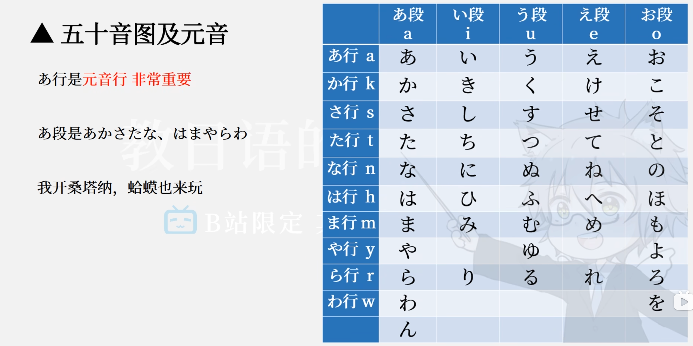

## 五十音图

# 什么是日语 五十音？ 平假，片假

日语的“五十音”指的是日语最基本的音节表，它包括平假名（ひらがな）和片假名（カタカナ）两种书写系统。它们本质上表示相同的发音，只是字体形式和使用场合不同。

### **1. 五十音是什么？**

* 日语以音节（假名）为单位，每个音节通常由一个辅音 + 一个元音组成（如 *か* ka），或者只有一个元音（如 *あ* a）。
* 五十音表通常分为 **行（横排）** 和 **段（纵列）**：

  * 行：あ行、か行、さ行……（根据第一个辅音分类）
  * 段：あ段、い段、う段、え段、お段（表示元音 a i u e o）
* 理论上有 5 × 10 = 50 个基本音，所以叫“五十音”。实际上还有一些浊音、拗音等扩展。

### **2. 平假名（ひらがな）**

* 用途：一般用于**原生日语词汇**、语法助词、动词变形等。
* 特点：线条圆润，曲线较多，看起来柔和。
* 例子：

  * あ (a)
  * い (i)
  * う (u)
  * え (e)
  * お (o)

### **3. 片假名（カタカナ）**

* 用途：用于**外来语**（例如“电脑”コンピュータ）、拟声词、强调或特殊场景。
* 特点：线条直、棱角分明，看起来更硬朗。
* 例子：

  * ア (a)
  * イ (i)
  * ウ (u)
  * エ (e)
  * オ (o)

✅ **核心记忆点：**

* 平假名和片假名发音相同，只是书写和用途不同。
* 五十音是日语发音的基础，相当于英语的字母表，但它是按音节排列。

# 如果是日语零基础或初学阶段，你可以根据自己的目标（比如兴趣学习、旅游交流、考JLPT）来选择合适的教材。这里我按**常见学习路线**帮你分一下：

## **1. 打好基础（发音+入门语法）**

**推荐教材：**

* **《大家的日本语 初级1、2》**

  * 优点：结构清晰、循序渐进、适合系统学习。
  * 缺点：全书是日文，需要配套中文翻译版或教师指导。
  * 适合：想打扎实基础、后续考JLPT的学员。

* **《新标日 初级 上、下》**（新版标准日本语）

  * 优点：自带中文解释，内容覆盖面广。
  * 缺点：例句稍显书面化，对口语帮助有限。
  * 适合：自学、需要详细语法讲解的人。

* **《みんなの日本語 初級》+语法翻译与练习册**

  * 如果能配合音频学习，效果最好。

## **2. 轻松兴趣类（不以考试为主）**

* **《大家的日语 会话篇》**

  * 更注重口语对话和生活场景。
* **《走遍日本》**

  * 场景化强，配有插图，适合想边学边了解日本文化的人。
* **《樱花日语》**

  * 情景会话+文化介绍，轻松有趣，适合兴趣学习。

## **3. 进阶与考试（JLPT N5\~N3）**

* **《TRY! 日本语能力试验对策 N5/N4/N3》**

  * 每章有例句+练习，考试取向强。
* **《新完全掌握 文法/听力/读解》系列**

  * 适合基础打牢后冲刺N3、N2。

## **4. 辅助材料**

* **单词记忆**：《日语单词速记》、Anki卡片、JLPT官方词汇表
* **发音练习**：NHK发音辞典（在线可查）+ NHK News Web Easy
* **听力口语**：Pimsleur Japanese、日剧/动画配字幕跟读

💡 **小建议**：

* 如果你**自学**，建议从《新标日》或《大家的日本语》开始，因为它们配套资料丰富、网上教程多。
* 如果**上课**，可以根据老师推荐的教材同步学习，这样课本与教学方法配套。
* 无论哪本教材，**假名、发音、基础语法要扎实**，后续学习会轻松很多。

# N2

下面是为准备 JLPT N2 初学者推荐的学习书籍及视频资源清单，希望能帮你打好基础，有效备考：

## 理想的 JLPT N2 初学者书籍推荐

### 综合类教材

* **Nihongo So-matome JLPT N2 系列**
  系列包含语法、词汇、汉字、阅读、听力等各分册，采用插图与短句，学习压力小，适合日常坚持练习，整体学习周期约 6 周([nihongo-career.com][1], [EDOPEN Japan][2])。

* **Shin Kanzen Master 系列（新完全マスター）**
  深入覆盖 N2 所需的语法、词汇、阅读、听力等内容，题量丰富、难度较高，适合追求突破或应对更严谨考试准备的学习者([Coto Japanese Academy][3], [EDOPEN Japan][2])。

### 针对专项训练的书籍

* **Speed Master N2 系列**
  包含语法、词汇、阅读、听力等类型书籍，每本结构明晰，分为“Warm-Up → Practice → Mock Test”，适合系统训练([EDOPEN Japan][2])。

* **Drill and Drill JLPT N2 系列**
  提供大量题目，专注熟悉题型与提升应试速度，适合强化练习([EDOPEN Japan][2])。

* **Nihongo Power Drill N2**
  以日常 10 分钟练习模块设计，适合时间有限但渴望高频练习的人([Coto Japanese Academy][3])。

### 词汇／汉字专项书籍

* **2500 Essential Vocabulary for the JLPT N2**
  涵盖 N2 常见词汇，按主题分类，并附示例句与中英文翻译，便于随身携带与复习([nihongo-career.com][1], [Coto Japanese Academy][3])。

---

## 推荐视频资源与在线课程

[All JLPT N2 Grammar – Quick Japanese](https://www.youtube.com/watch?pp=ygUFI29mbjI%3D&v=ezwSDEmVjXg&utm_source=chatgpt.com)

* 精炼呈现 N2 语法点，适合快速复习重点难点。

其他推荐：

* **Nihongo no Mori（の日本語の森）** 与 **Deguchi-sensei** 的 YouTube 语法讲解频道，依据 Reddit 经验分享：

  > “JLPTSensei, JapaneseTest4You, and the Shinkanzen Master books helped me a LOT in passing the N2. … Deguchi-sensei and Nihongo no Mori’s YouTube channels are excellent for understanding grammar.”([Reddit][4])。

在线课程推荐：

* **JapanesePod101 JLPT N2 Master Course**
  包括 84 个音频课、20 个视频课与 24 个测验，覆盖 958 词汇，适合听说读写全面提升([JapanesePod101][5])。

* **Chika Sensei 的 JLPT N2 全方位课程**
  视频讲解语法、听读理解，配合语法测验（270 道题）与词汇／汉字测验功能，适合系统学习([日语学习网][6])。

---

## 书籍与视频适用建议一览

| 学习目标      | 推荐资源                                      |
| --------- | ----------------------------------------- |
| 综合入门      | Nihongo So-matome 系列                      |
| 高强度全面突破   | Shin Kanzen Master 系列                     |
| 系统专项强化    | Speed Master N2、Drill and Drill 系列        |
| 快速随身背单词   | 2500 Essential Vocabulary                 |
| 语法重点复习    | “All JLPT N2 Grammar – Quick Japanese” 视频 |
| 深入语法理解    | Nihongo no Mori / Deguchi-sensei 频道       |
| 听力与语法全面提升 | JapanesePod101 N2 Master Course           |
| 系统线上学习    | Chika Sensei 全方位课程                        |

---

这些资源覆盖了从词汇、语法、阅读、听力到模拟测试的各个方面，适合初学阶段分模块学习并逐步提升。你可以根据你的学习风格或当前薄弱部分进行选择和搭配使用。

如果你想进一步针对某个部分（如听力或阅读）获取更多推荐，也可以告诉我，我可以继续帮你挖掘适合的资源～

[1]: https://nihongo-career.com/tips/2025/02/23/15-best-textbooks-for-jlpt-n2/?utm_source=chatgpt.com "15 Best Textbooks for JLPT N2 | Nihongo Online School"
[2]: https://global.japanese-bank.com/learn-japanese/10-most-famous-powerful-textbooks-to-pass-jlpt-n2-a-z-important-things-you-need-to-know/?utm_source=chatgpt.com "10 Most Famous & Powerful Textbooks to Pass JLPT N2"
[3]: https://cotoacademy.com/jlpt-n2-books-for-advanced-japanese-learners/?utm_source=chatgpt.com "15 JLPT N2 Books for Advanced Japanese Learners - Coto Academy"
[4]: https://www.reddit.com/r/jlpt/comments/sml99t/hi_guys_any_recommended_books_for_me_to_study/?utm_source=chatgpt.com "Hi guys, any recommended books for me to study JLPT N2 Test? I ..."
[5]: https://www.japanesepod101.com/lesson-library/jlpt-n2-master-course?utm_source=chatgpt.com "JLPT N2 Master Course - JapanesePod101"
[6]: https://japanasubi.teachable.com/p/jlpt-n2-course-all-in-one?utm_source=chatgpt.com "JLPT N2 All-in-One Course - Chika Sensei's Japanese Academy"

