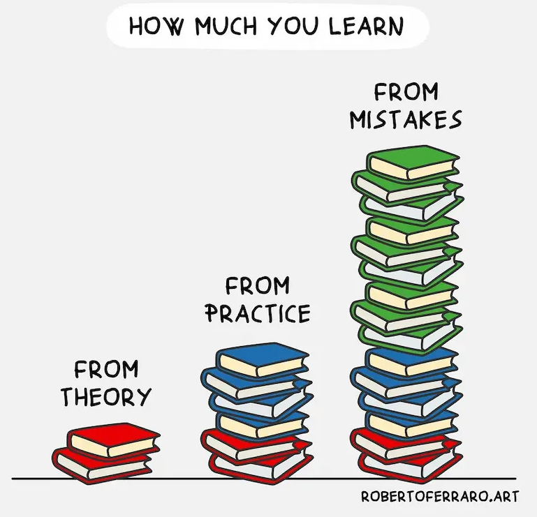

# 学习的状态  [了解，练习，doing ，反思，习惯]

# 灵感来自反复思考[散步思考，谋定而思动]
反复思考 价值，然后操作 [先思考，后操作]

# 懂了，理解，学会 [doing]

学习的目的是 **学会**
**学会/理解** 的方法： 学习（输入）+ 思考 +实践（输出） 。

输入（学习） + 输出（思考+实践）

# 知识分类

- 理性知识
- 感性知识

## 感性知识，个人的观点，观念，认知 是个人理解

你眼中的世界只是你个人眼中的世界，你对世界的评价，会受到环境的影响

我不活在过去，我活在当下，把家人照顾好 (所以历史虚荣对我个人不是很重要)

# 学会学习：科学方法与实践指南

学习不仅是知识的积累，更是能力、思维、习惯和情感的持续成长。科学研究表明，学习的本质在于大脑神经网络的可塑性和行为的不断优化。高效学习应遵循以下原则和方法：

## 一、学习的科学原理
1. 神经可塑性
大脑通过不断建立和强化神经连接，实现知识和技能的内化。重复、实践和反思是巩固记忆的关键。

2. 强化与反馈
正向反馈（如奖励、成就感）能增强学习动力，及时纠错和反思有助于优化学习路径。

3. 多通道输入
结合视觉、听觉、动手操作等多种感官，能显著提升理解和记忆效果。

4. 情境与情绪
积极的情绪和真实的应用场景能激发兴趣，提高专注力和学习效率。

## 二、科学学习方法

1. 目标导向与分阶段

- 明确学习目标，制定可量化的阶段性计划。
- 将复杂内容分解为小模块，逐步攻克，最后串联整体知识结构。

2. 主动学习与深度思考

- 不仅被动接受，更要主动提问、归纳总结、举一反三。
- 通过“费曼技巧”讲解知识，检验理解深度。

3. 间隔重复与巩固

- 利用遗忘曲线，定期复习，防止遗忘。
- 采用“分散学习”而非“临时抱佛脚”。

4. 实践与应用

- 理论结合实践，动手操作、项目实战、模拟演练。
- 错误和失败是最好的老师，及时复盘总结经验。

5. 专注与管理干扰

- 保持注意力，减少多任务切换。
- 合理安排学习时间，采用番茄钟等专注工具。
- 当切换到其他任务时，要花费精力去回忆其他任务的进度，并恢复现场，这样就会花费时间
- 所以最好主流程不要随意变更

6. 反馈与自我反思

- 主动寻求外部反馈，及时调整学习策略。
- 记录学习日志，反思进步与不足。

7. 向 AI 老师请教，要问对问题，抓住问题本地很重要

8. 探索学习或研究

对于没有现成书本讲解的学习内容，收获最多的学习途径就是实际操作，研究并思考。

书本知识只是基础，实践应用可以学到更多，如果实践发生错误，那就是最好的学习机会。

就是在犯错中学习，有目标的学习。

## 三、学习流程建议

设定目标 → 分解任务 → 主动探索 → 实践应用 → 反馈复盘 → 巩固提升

## 四、补充建议

- 善用工具：思维导图、笔记软件、错题本等辅助整理和回顾知识。
- 保持好奇心和成长型心态，持续学习，勇于挑战新领域。
关注身心健康，合理作息，保证大脑高效运转。

总结：
高效学习是科学原理与自我管理的结合。明确目标、主动思考、实践应用、及时反馈和持续复盘，是实现知识内化和能力提升的核心路径。