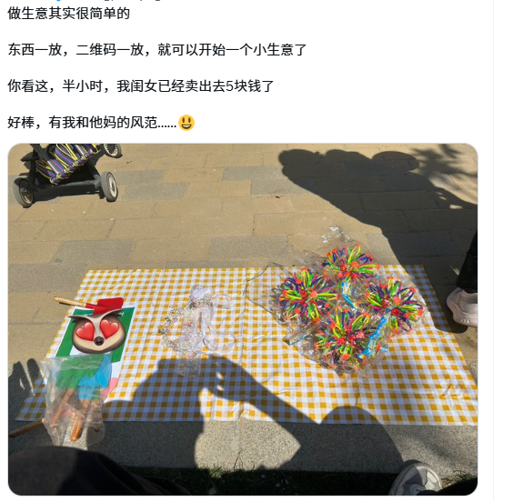

## 贸易活动（经济活动）

交易 是交换 人类的 需求，是人类活力的体现

## 人类有哪些活动

1. 生产
2. 经济
3. 文化娱乐
4. 教育学习
5. 政治与社会
6. 宗教与精神
7. 家庭与亲密关系
8. 环境保护与社会责任
9. 科学与技术交流
10. 沟通与信息交流
11. 司法与道德

## 逆人性，自私是刻在基因里的

1、解决什么问题用户才会愿意来我的网站？
2、发什么内容对别人最有价值？
3、如何真正帮人学好英语？
4、怎么才能【帮别人】赚到 100 万？

## 做生意



## 商业

业务模式要清晰，比如定价统一

## 成交

发布营销 就可能有客户

## 营销文案，话术
## 软件行业劣势

```
为什么要卖软件？而不是去卖鸡？

闺女要吃鸡腿儿，然后我来买鸡。然后我发现人家的收款提醒，一直没停过。然后我再看看我的收款提醒，一直没响过。

于是，我陷入了沉思。为啥啊？
```

资源诅咒，认为自己会做软件是个优势

实际上默认自己的行业选择是个极大的劣势

2019 年我在做社交产品 (软件)
2020 做社交游戏(软件)
2021 卖了情感课程、饿了么优惠券、性格测试 H5、拼多多护肤品、玄学首饰

自从不做软件，打通任督二脉，没亏过一分钱

鸡，确实没卖过

但是卖过卫生巾和 cupcake

1. 英语推广

<!-- 2. 代购 （竞争者 山姆） -->

3. 大模型

## 可落地的刚需

餐饮

学习做亚马逊电商，但现在很难了，稀缺可以提高价格。
创新竞争少，同质化模仿面临竞争

感觉**维修家电** 类的好点（有复购）

数字营销,这个也好（学习，脸皮厚），出境不说太多话

## 其他 (定制的)
**1. 本地生活服务类：**

*   **维修与保养:**
    *   **家电维修:** 空调、洗衣机、冰箱等常见家电的维修和保养。技术要求较高，但一旦掌握，需求稳定。
    *   **管道疏通/维修:** 下水道堵塞、水龙头漏水等紧急问题，需求频繁。
    *   **开锁服务:** 紧急开锁需求，利润相对较高，但需符合相关法律法规。
    *   **电脑/手机维修:** 针对个人和小型企业的电脑、手机硬件和软件问题提供维修服务。
    *   **房屋基础维修:** 简单的墙面修补、家具维修、门窗维护等。
*   **个人护理与健康:**
    *   **上门推拿/理疗:** 针对有慢性疼痛或需要放松的人群提供上门服务。需具备相关资质。
    *   **产后恢复指导:** 为新手妈妈提供专业的产后康复指导和支持。需具备专业知识。
    *   **个性化健身指导:** 线上或线下提供一对一的健身指导和训练计划。需具备健身专业知识。
*   **社区便民服务:**
    *   **跑腿代办:** 帮助社区居民代买、代送、代缴费等。需求灵活，易于上手。
    *   **家政服务（专项）：** 专注于某一领域的家政服务，如深度清洁、擦玻璃、除螨等。
    *   **宠物服务:** 遛狗、喂养、简单护理等，针对养宠物人群。

**2. 专业技能服务类：**

*   **线上内容创作/自媒体:**
    *   **垂直领域知识分享:** 在特定领域（如美食、旅游、育儿、技能等）创作内容，通过平台分成、广告、付费内容等盈利。需要持续输出高质量内容。
    *   **文案/软文撰写:** 为企业或个人提供文案、广告语、软文等撰写服务。
    *   **短视频制作/剪辑:** 为企业或个人制作短视频内容。
*   **设计类:**
    *   **平面设计:** Logo设计、海报设计、宣传册设计等。
    *   **网页设计（前端/后端）：** 为小型企业或个人搭建网站。
    *   **UI/UX设计:** 优化用户体验和界面设计。
*   **咨询/顾问类:**
    *   **职业规划咨询:** 帮助他人进行职业发展规划。
    *   **心理咨询（线上）：** 提供在线心理咨询服务。需具备相关资质。
    *   **特定领域顾问:** 基于自身专业知识，为企业或个人提供专业咨询服务。
*   **翻译/本地化服务:** 为企业或个人提供语言翻译和本地化服务。
*   **财税代理/记账:** 为小型企业或个体户提供代理记账、报税等服务。需具备相关资质。

**3. 特定产品销售类（轻资产模式）：**

*   **农副产品/特色食品:** 通过线上渠道销售家乡特色农副产品或手工食品。需注重品质和口碑。
*   **母婴用品/儿童玩具:** 选择有品质保障的品牌或特色产品进行线上销售。
*   **健康/养生产品:** 销售经过市场验证的健康食品或保健品。需注意合规性。
*   **个性化定制产品:** 提供个性化定制的礼品、服装、家居用品等。

**选择时的考虑因素：**

*   **个人技能与兴趣:** 选择自己擅长且感兴趣的领域，更容易坚持下去并提供高质量的服务或产品。
*   **市场需求:** 调研当地或线上市场对该服务的需求程度。
*   **启动成本:** 考虑启动资金、设备、工具等成本。单人创业应尽量选择低成本的项目。
*   **竞争情况:** 分析竞争对手的情况，找到差异化优势。
*   **盈利模式:** 思考如何通过提供服务或销售产品获得收入。
*   **可扩展性:** 虽然是单人创业，也要考虑未来是否有可能扩展。
*   **合规性:** 确保所选择的项目符合相关的法律法规和行业规定。

**单人创业的优势与挑战：**

*   **优势:** 决策快、自由度高、利润独享。
*   **挑战:** 工作强度大、需要具备多方面能力、抗风险能力相对较弱。

**建议：**

*   **从小处着手:** 先从小的、可控的项目开始尝试。
*   **注重口碑:** 通过高质量的服务或产品赢得客户信任。
*   **利用互联网:** 借助社交媒体、电商平台等拓展业务。
*   **不断学习:** 保持学习心态，提升自身技能。
*   **建立人脉:** 积极参与社群交流，拓展行业人脉。

 
### 1. **线上教育与培训**
随着在线学习的普及，线上教育和培训需求日益增加。你可以根据自己的专业技能或兴趣提供定制化的教学服务：
- **语言学习**：如英语、中文等外语教学。
- **技能培训**：如编程、设计、营销、写作等技能培训。
- **音乐/美术/手工艺**：如果你有相关艺术技能，可以提供个性化的课程。
- **考试辅导**：如高考、托福、雅思等考试辅导。

### 2. **自由职业者（Freelancer）**
如果你擅长某些专业技能，可以做自由职业者：
- **写作与内容创作**：提供博客、文章、广告文案、社交媒体内容等写作服务。
- **平面设计与UI/UX设计**：为公司或个人客户提供设计服务。
- **编程与开发**：为小型企业提供网站建设、应用开发等服务。
- **视频编辑与音频编辑**：可以为需要内容创作的公司或博主提供视频剪辑服务。
- **翻译与语言服务**：如果你精通多国语言，提供翻译或语言相关服务。

### 3. **个人品牌与社交媒体管理**
随着社交媒体的火爆，越来越多的个人和小型企业需要帮助来管理他们的社交媒体账号，提升曝光度和与受众的互动。
- **社交媒体内容管理与策划**：为小企业、个人或品牌提供内容创作、发布计划、互动回复等服务。
- **个人品牌建设**：如果你擅长某一领域，可以通过分享知识、经验等吸引粉丝，打造个人品牌并进行变现。

### 4. **线上商店（电商）**
电商已经成为一个庞大的市场，适合单人创业的电商项目包括：
- **无库存电商（Dropshipping）**：你可以建立一个网店，将产品销售给顾客，而产品由供应商直接发货，省去了库存管理。
- **二手商品买卖**：你可以通过线上平台（如闲鱼、eBay等）出售二手商品，或做二手奢侈品买卖。
- **手工艺品或定制商品**：如果你擅长某项手工艺（如饰品、家居用品等），可以通过平台销售自制商品。

### 5. **家庭清洁与保洁服务**
清洁服务是市场上的刚需，适合单人创业的方向有：
- **家庭清洁**：为家庭客户提供定期的清洁服务。
- **办公室清洁**：为公司提供定期的办公室清洁服务。
- **搬家清洁**：搬家后提供深度清洁。

### 6. **宠物护理与相关服务**
随着宠物数量的增加，宠物相关的服务需求也在增多：
- **宠物美容与护理**：为宠物提供洗澡、美容、剪毛等服务。
- **宠物寄养与遛狗服务**：提供宠物寄养、遛狗、宠物看护等服务。
- **宠物用品销售**：销售宠物食品、玩具等产品，可以通过线上平台进行。

### 7. **健康与健身**
随着人们健康意识的提高，健康和健身相关的服务也有着广泛需求：
- **私人教练**：如果你有健身相关的证书，可以做个人健身教练，提供一对一的训练课程。
- **营养咨询**：提供饮食规划和营养指导服务，帮助客户制定健康的饮食方案。
- **瑜伽与冥想课程**：如果你精通瑜伽或冥想，可以开设线上或线下的瑜伽课程。

### 8. **清理与修理服务**
- **家电修理**：为家庭提供家电修理、维护等服务。
- **手机维修**：如果你有技术背景，可以提供手机屏幕更换、电池更换等修理服务。
- **家具修理与翻新**：提供家具修理、翻新等服务，尤其是在二手家具市场需求较大的地方。

### 9. **代购与跨境电商**
在跨境电商蓬勃发展的今天，代购依然是一个受欢迎的创业方向：
- **代购服务**：为顾客代购国外商品，尤其是在化妆品、电子产品等领域。
- **跨境电商**：如果有跨境电商经验，可以通过平台如阿里巴巴、亚马逊、eBay等销售国外商品，或者销售中国商品到国外市场。

### 10. **本地配送服务**
随着在线购物的普及，本地配送需求越来越大：
- **外卖配送**：与本地餐馆合作，提供外卖配送服务。
- **快递代收与代寄**：为小区居民提供快递代收、代寄服务，尤其是在快递集中地区。

### 11. **环保与回收**
- **二手物品回收**：为周边社区提供二手物品回收服务，尤其是电子废弃物、旧衣物等。
- **环保产品销售**：销售环保袋、可降解产品等环保产品，迎合环保趋势。

### 总结：
选择适合单人创业的项目时，需要考虑市场需求、自己的技能、投资成本和运营能力。以上列举的这些项目大多数都属于刚需类别，且在资源有限的情况下可以相对容易地启动和运营。最重要的是，选择自己擅长或者感兴趣的领域，这样你可以在创业过程中保持动力并克服困难。

### 短视频网站营销方案（英语学习版）

在如今短视频盛行的时代，短视频已成为品牌推广、产品营销和内容创作的重要阵地。对于学习英语的用户而言，短视频不仅是一种娱乐消遣的方式，也是提升语言技能的有力工具。下面，我将为您提供一个结合英语学习内容的短视频网站营销方案，让您能够有效地将英语学习与短视频营销结合，吸引更多观众并提高参与度。

---

### **1. 定位目标群体**

首先，确定您的目标观众是谁，是初学者、中级学员，还是高级学习者？了解目标群体的需求，能够帮助您制定更加精准的内容策略。

- **初学者**：希望通过简短易懂的视频来入门英语，注重基础词汇、发音、句型等内容。
- **中级学员**：想要提高词汇量、语法知识和日常对话的流利度，偏向于具有实用性的短视频内容。
- **高级学员**：已经具备一定英语基础，目标是提升听力理解、口语表达以及写作能力，适合分享更深层次的文化、语法和高级词汇等内容。

---

### **2. 视频内容策划**

针对英语学习，短视频的内容可以分为以下几类，每类视频的风格和主题可以灵活变化，以提高观众的互动性和粘性。

#### **2.1 英语学习技巧与窍门**
这类视频可以分享一些高效的英语学习方法、记忆技巧和学习经验，帮助观众更高效地学习英语。

- **视频标题例子**：
  - "5 Fun Ways to Learn English Vocabulary"
  - "3 Tips for Perfecting Your English Pronunciation"
  - "How to Improve Your English Listening in Just 10 Minutes a Day"
  
- **内容方向**：
  - 各种记单词的技巧（例如联想记忆法、卡片记忆法）
  - 发音技巧，教观众如何发好难度较大的英语音标
  - 听力提升的建议，如何通过看英文电影、新闻等提高听力水平

#### **2.2 日常对话与情境演练**
通过模拟日常生活中的英语对话，帮助观众更好地在实际生活中使用英语。

- **视频标题例子**：
  - "How to Order Food in English Like a Pro"
  - "Common Phrases to Use at the Airport"
  - "What to Say When You Meet Someone New in English"
  
- **内容方向**：
  - 模拟日常场景，如在咖啡店、餐馆、商场、机场等地方的英语对话
  - 教常用短语和句型，帮助观众能够自信地进行日常交流

#### **2.3 文化与趣味话题**
介绍一些英语国家的文化、节日、流行语等，让学习者不仅学语言，还能更好地理解英语背后的文化。

- **视频标题例子**：
  - "10 Fun Facts About English-Speaking Countries"
  - "English Slang You Need to Know in 2025"
  - "What’s the Difference Between British and American English?"
  
- **内容方向**：
  - 英语国家的节日、传统、美食等文化介绍
  - 常见的英语俚语和日常口语表达
  - 英语国家的社交礼仪、行为规范等

#### **2.4 学习进度与挑战**
通过定期发布学习进度和挑战，激励观众积极参与，甚至可以设计一些互动环节，鼓励观众上传自己的英语学习视频，形成互动性强的社区氛围。

- **视频标题例子**：
  - "30-Day English Challenge: Let’s Speak Together"
  - "Can You Guess the Meaning of These 5 English Idioms?"
  - "7-Day Vocabulary Challenge: How Many Words Can You Learn?"
  
- **内容方向**：
  - 设计学习挑战（如每天学10个单词、每周做一个英语口语练习）
  - 邀请观众参与留言、评论，分享自己的学习进展
  - 定期评选优秀的学习视频或评论，奖励互动积极的观众

---

### **3. 视频风格与制作**

短视频的最大特点就是时间短、信息密集，因此视频制作要简洁明了，能够迅速抓住观众的注意力。

#### **3.1 视频时长控制**
保持视频时长在**15秒到1分钟**之间。这样能保证观众不会感到枯燥，且内容足够精炼。

- 对于技巧类视频，1分钟是最佳时长。
- 对于情境模拟，可以将其分成几段，分期发布，持续吸引观众。

#### **3.2 互动元素**
- 视频中可以加入**互动问题**，鼓励观众在评论区分享他们的答案或经验。
- 通过**投票、评论、挑战**等方式增加观众参与度。例如，在一个关于俚语的视频中，询问观众是否知道其他常见的俚语，激励他们分享。

#### **3.3 风格与配乐**
- 视频内容可以通过加入生动有趣的动画、图表、字幕来提高信息传递效率。
- 配乐的选择要符合内容风格，使用轻松活泼的背景音乐，但音量不要盖过讲解的声音。

---

### **4. 发布与推广**

#### **4.1 定期发布**
- 每周定时发布新内容，保持更新频率。例如，安排每周两到三次的更新，观众会期待下一期的内容。
- 特定节日或事件时，可以制作节日特辑或者应景的视频内容。

#### **4.2 使用标签（Hashtags）**
- 在视频中使用相关的标签，如#LearnEnglish #EnglishTips #DailyEnglish等，这些标签会增加你视频的曝光率。
- 根据视频内容使用热门标签，吸引更多感兴趣的观众。

#### **4.3 合作与跨平台宣传**
- 与其他英语学习内容创作者或者语言学习平台合作，互相推广。
- 跨平台宣传，除了短视频网站，还可以通过社交媒体、博客等平台进行内容推广，吸引更多用户观看。

---

### **5. 数据分析与优化**

通过数据分析来了解哪些类型的视频最受欢迎，哪些时段发布视频效果最好，哪些标签能增加曝光。根据这些反馈来不断优化内容策略。

- 使用平台的分析工具，查看**观看时长、互动率、分享量**等数据。
- 根据反馈调整内容方向和发布策略。

---

### **总结**

短视频营销在英语学习领域的应用是非常广泛的。通过精准的内容定位、创意视频制作和高效的互动手段，能够吸引更多英语学习者并提升他们的学习兴趣和参与度。持续优化内容和推广策略，并根据观众的反馈进行调整，会使您的短视频营销取得更大的成功。

加油，相信通过这份营销方案，您的英语学习短视频一定能吸引大批粉丝并帮助更多人提高英语水平！📈🎥

好的，亚马逊和独立站是两种不同的电商模式，学习开店的平台和资源也会有所不同。以下分别针对亚马逊和独立站，为你推荐一些学习开店的网站和平台：

**一、 学习亚马逊开店的网站和平台：**

*   **亚马逊卖家中心 (Seller Central):** 这是官方提供的卖家后台，也是最重要的学习资源。你可以在这里找到：
    *   **卖家大学 (Seller University):** 包含各种主题的视频教程和指南，涵盖账户注册、产品Listing、运营推广、客户服务、FBA（亚马逊物流）等方面。
    *   **卖家帮助中心:** 提供详细的政策、常见问题解答和操作指南。
    *   **新闻和公告:** 了解亚马逊最新的政策变化和平台更新。
    *   **论坛 (Seller Forums):** 可以与其他卖家交流经验、提问和获取帮助。

*   **亚马逊全球开店官方网站 (sell.amazon.cn):** 提供关于在全球不同亚马逊站点开店的信息和资源，包括注册流程、市场分析、成功案例等。

*   **第三方亚马逊培训机构和社区:** 有很多提供亚马逊开店培训课程和交流社区的机构和个人，例如：
    *   **知无不言:** 国内比较知名的亚马逊卖家论坛，有很多经验分享和行业讨论。
    *   **积特学院、跨境盒子、雨果跨境等:** 提供付费或免费的亚马逊培训课程、文章和工具。
    *   **B站、YouTube等视频平台:** 搜索“亚马逊开店”、“Amazon FBA”等关键词，可以找到很多卖家分享的经验和教程。

**学习亚马逊开店的重点：**

*   **了解亚马逊的规则和政策:** 这是避免违规和账户被封的关键。
*   **学习选品技巧:** 找到有市场需求且竞争不激烈的潜力产品。
*   **掌握Listing优化技巧:** 撰写吸引人的标题、描述和关键词，拍摄高质量的产品图片。
*   **学习运营和推广方法:** 了解站内广告（PPC）、促销活动、站外引流等。
*   **理解FBA物流的运作流程和优势。**
*   **关注客户服务和评价管理。**

**二、 学习独立站开店的网站和平台：**

*   **Shopify 官方网站 (shopify.com):** Shopify 是全球领先的独立站建站平台，其官方网站提供了丰富的学习资源：
    *   **Shopify Help Center:** 包含详细的操作指南、常见问题解答和教程，涵盖店铺设置、产品管理、支付收款、物流配送、营销推广等方面。
    *   **Shopify Compass:** 提供免费的课程、指南和研讨会，帮助你学习电商知识和Shopify的使用技巧。
    *   **Shopify Blog:** 发布关于电商趋势、营销策略、成功案例等文章。
    *   **Shopify Community:** 用户论坛，可以与其他Shopify用户交流学习。

*   **Shopify App Store:** 了解和学习如何使用各种Shopify应用来扩展店铺功能。

*   **其他独立站建站平台（如 WooCommerce, BigCommerce 等）的官方网站:** 这些平台也提供相应的帮助文档和学习资源。

*   **第三方独立站培训机构和社区:** 同样有很多机构和个人提供独立站开店和运营的培训课程和交流社区，例如：
    *   **Morketing、SocialBeta 等营销平台:** 提供关于独立站营销推广的文章和案例。
    *   **各大跨境电商论坛和社群:** 也会有关于独立站运营的讨论。
    *   **B站、YouTube等视频平台:** 搜索“Shopify开店”、“独立站运营”等关键词，可以找到很多相关教程。

**学习独立站开店的重点：**

*   **选择合适的建站平台并熟悉其操作。**
*   **学习店铺设计和用户体验优化。**
*   **掌握产品上架和管理技巧。**
*   **了解各种支付和物流方式的对接。**
*   **学习独立站的营销推广方法，例如：**
    *   **SEO（搜索引擎优化）**
    *   **社交媒体营销（Facebook、Instagram、TikTok等）**
    *   **内容营销**
    *   **联盟营销**
    *   **邮件营销**
    *   **付费广告（Facebook Ads、Google Ads等）**
*   **关注数据分析，了解用户行为和营销效果。**
*   **重视品牌建设和客户关系管理。**

**建议你的学习路径：**

1.  **明确你想要从事的电商模式:** 是想在亚马逊这样的平台销售，还是建立自己的独立品牌网站？这会决定你学习的重点。
2.  **先从官方资源入手:** 亚马逊卖家中心和Shopify官方网站是学习的最权威和最基础的来源。
3.  **结合第三方资源:** 阅读博客文章、观看视频教程、参与社群讨论，可以更深入地理解和学习。
4.  **理论结合实践:** 在学习的过程中，尝试注册账户、上架产品、进行简单的操作，边学边做才能更好地掌握。
5.  **持续学习和关注行业动态:** 电商行业变化很快，要保持学习的热情，不断更新知识和技能。

无论选择亚马逊还是独立站，都需要投入时间和精力去学习和实践。希望以上推荐能帮助你找到合适的学习资源，祝你开店顺利！