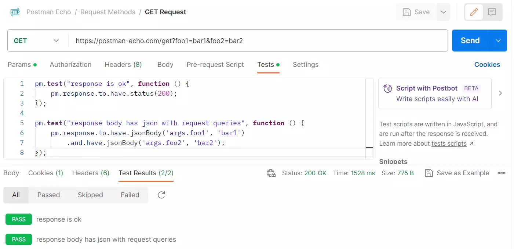

## 如何使用 Postman 进行 API 测试

我觉得大致上来说，使用 Postman 进行 API 测试的流程，可以分成以下几个步骤：

- 新增 HTTP 要求 (Add request)
- 先确认可以顺利按下 Send 发出 HTTP 要求
- 切换到 Tests 页签撰写测试案例（ 使用 JavaScript 即可）
- 再次按下 Send 发出 HTTP 要求，并查看测试结果 （ Test Results ）




测试脚本如下：

``` js
pm.test("response is ok", function () {
    pm.response.to.have.status(200);
});
```
