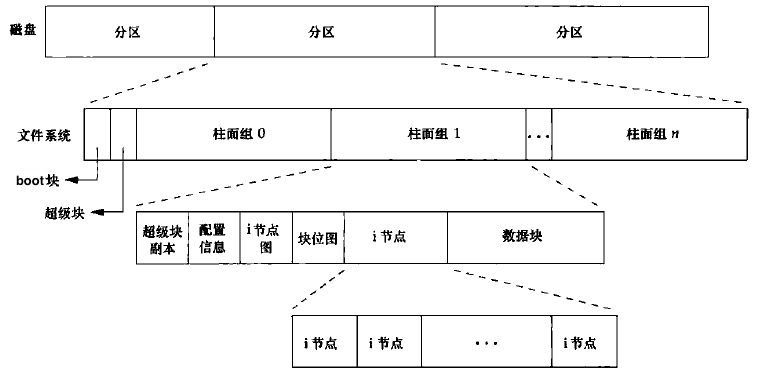
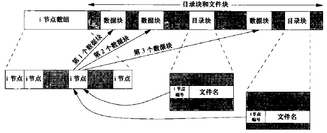

## 文件操作 
! 给软件 一个 文件操作的功能

可以读写的笔记，实现细节复杂，注意不要同时写入同一文件。

文件的必要性：键盘是文件，鼠标是文件，显示器是文件，这些文件默认是打开的，还有其他文件要自己手动打开

这里最先学习的是 给 应用一个 文件操作的功能，现在很多软件都有文件操作功能啦。

```sh
cat < a.file > b.file
```

## 文件的底层，文件系统







stat: 获取与 pathpath 文件名有关的信息结构，存在 buf 中
文件属性

### 用户ID和组ID

获取用户信息

whoami / whois
chown

### 文件，进程访问权限

### 硬链接和软链接(符号链接)

link

### 目录
mkdir
rmdir
rename

### 设备

``` sh
cat /proc/devices
```
### 文件分类

流

文件

缓冲

## 进程

启动程序，需要创建一个进程信息 方便管理 执行中的 程序

### 进程的属性

进程号

> 0号进程：调度进程（也称系统进程或交换进程）
> 1号进程：init 进程 (读取初始化文件，引导到用户态；成为所有孤儿进程的父进程)

### 进程管理

fork 创建
exec
exit  正常终止
不管正常终止或异常终止，内核都向父进程发送SIGCHLD信号，父进程可以选择忽略该信号(默认动作)，或者提供一个信号处理函数

父进程能通过wait、waitpid获取子进程的终止状态


## 进程间通信

### 管道
### FIFO