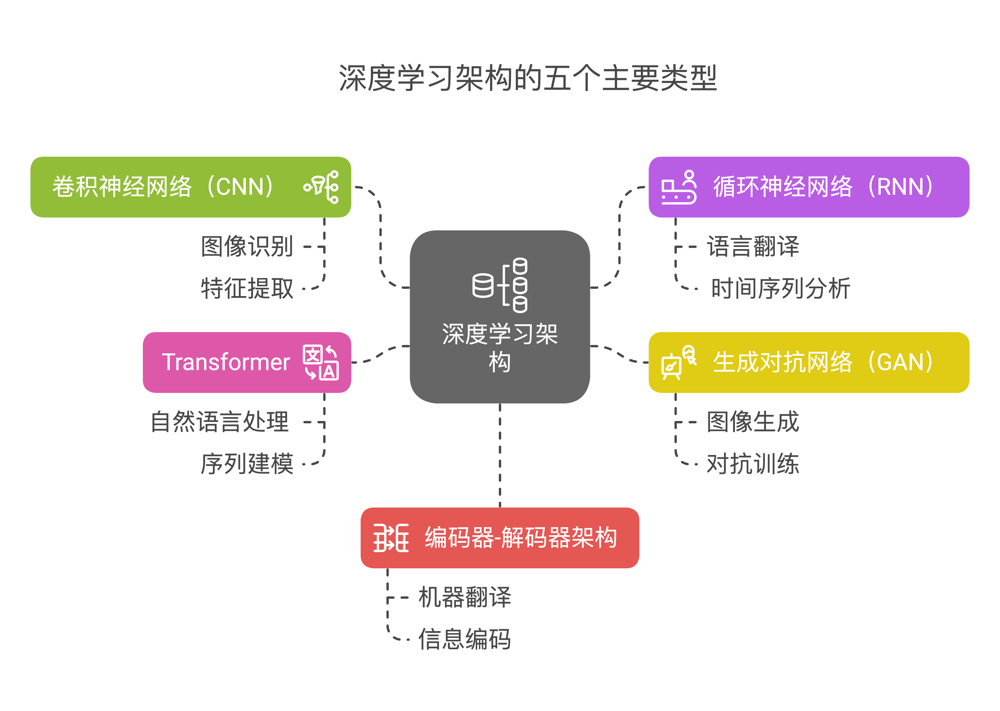

人工智能的前提是思考 人的大脑是如何从经验中提取信息进行思考的。

# 当前AI绘图的能力已经达到要求不高的 文章插图类的工作了

# 大模型API价格，gpt 价格，llm 价格

https://chenshake.com/2025/03/01/all-model-api-price/

# AI 工具
- [模型微调可视化UI]( https://github.com/hiyouga/LLaMA-Factory)


# 深度学习

机器学习：有各种不同的学习技巧
深度学习的方式，是按照人的常规死记硬背的学习方式 进行 知识的收集

 深度学习采用的是 **监督学习**、**无监督学习**、**半监督学习** 和 **强化学习** 等多种学习方法，具体采用哪种方法取决于任务的性质和目标。以下是这几种学习方法的简要说明：

### 1. **监督学习 (Supervised Learning)**

   - **定义**：监督学习是一种通过“标签”或“标注数据”来训练模型的方法。给定一组输入数据和对应的正确输出（标签），模型通过学习这些数据的输入输出关系，来预测新的、未见过的数据的输出。
   - **应用**：大多数深度学习应用，如图像分类、语音识别、自然语言处理等，主要采用监督学习方法。
   - **示例**：给定一组带标签的图像数据（如猫和狗的图片标签），训练深度神经网络去分类新图像是否是猫或狗。

### 2. **无监督学习 (Unsupervised Learning)**

   - **定义**：无监督学习不依赖于标签数据，模型根据输入数据的内在结构进行学习，尝试从数据中挖掘出有用的模式或规律。通常用于聚类、降维等任务。
   - **应用**：在深度学习中，无监督学习常用于数据压缩、特征提取、异常检测等任务。
   - **示例**：利用无监督学习方法，如自编码器（Autoencoders），从输入数据中提取出重要的低维特征表示。

### 3. **半监督学习 (Semi-Supervised Learning)**

   - **定义**：半监督学习结合了监督学习和无监督学习的特点，通常只有少量带标签的数据和大量无标签的数据。模型在带标签数据的帮助下，利用无标签数据中的结构信息来提高学习效果。
   - **应用**：半监督学习在标注数据稀缺的情况下非常有用，如医疗影像分析、文本分类等领域。
   - **示例**：在训练一个深度学习模型进行图像分类时，只有一小部分图像有标签，而其他图像没有标签。半监督学习可以利用未标记的图像来帮助模型提高性能。

### 4. **强化学习 (Reinforcement Learning)**

   - **定义**：强化学习是一种基于行为和奖励的学习方法，模型（智能体）通过与环境交互，采取行动并根据环境反馈的奖励或惩罚来调整自己的策略。目标是最大化长期的累积奖励。
   - **应用**：强化学习通常用于那些涉及决策的任务，如自动驾驶、机器人控制、游戏策略等。
   - **示例**：AlphaGo、自动驾驶汽车等就是强化学习的典型应用。智能体通过不断地与环境互动，调整策略，以达到最优的决策效果。

---

### 总结：
深度学习系统通常是通过 **监督学习**（主要），并结合 **无监督学习** 和 **强化学习**，根据具体的任务和数据形式进行学习。
监督学习常用于有明确标签的数据集，常见于分类、回归等任务；无监督学习和半监督学习用于处理没有标签的数据，强化学习则用于动态环境中的决策问题。


## 深度学习架构




## 样本数据集


## 监督学习

### 分类

###  回归 : 预测一个连续值

## 准备

1. 模型类型 （学什么学科，有日常交流学科，文字生成(文科），图片识别(图像科）模型，推理模型）

2. 模型框架（学习方法）

3. 数据集 (学科的具体内容)

- 进行文本数据的分词、词干提取/词形还原、构建词汇表等。
- 进行图像数据的缩放、裁剪、增强等。
- 将数据划分为训练集、验证集和测试集（通常比例为 70-80%、10-15%、10-15%）。

4. 搭建环境 python ,使用学习框架 ternsorFlow ,PyTorch，安装依赖库NumPy

## 模型训练

1. 编写代码 实现模型的能力
2. 定义损失函数
3. 选择优化器
4. 编写训练循环
5. 监控训练过程

# 机器学习 

### 1. 数据

机器学习的核心是数据驱动的学习过程。数据包括输入数据（特征）和相应的输出标签（对应的目标），用于训练模型和评估模型的性能。

### 2. 监督学习、无监督学习和强化学习

- **监督学习**：通过已标记的数据（包含输入特征和对应的输出标签）来训练模型，使其能够预测新数据的输出。常见的算法有线性回归、逻辑回归、决策树、支持向量机（SVM）、神经网络等。

- **无监督学习**：使用未标记的数据来训练模型，目标是发现数据中的模式和结构。常见的算法包括聚类（如K均值聚类）、降维（如主成分分析PCA）、关联规则等。

- **强化学习**：模型通过与环境的交互学习，在面对复杂环境时采取动作以最大化预期的累积奖励。典型的应用包括智能游戏、自动驾驶和机器人控制等。

### 3. 损失函数和优化算法

- **损失函数**：衡量模型预测结果与实际标签之间的差异。常见的损失函数包括均方误差（MSE）、交叉熵等。

- **优化算法**：用于最小化损失函数以优化模型参数，例如梯度下降（包括批量梯度下降、随机梯度下降和小批量梯度下降）、Adam优化器等。

### 4. 泛化能力与过拟合

- **泛化能力**：模型对未见过的数据的适应能力。好的机器学习模型应该具有良好的泛化能力，而不仅仅是在训练数据上表现良好。

- **过拟合**：模型在训练数据上表现很好，但在测试数据或新数据上表现不佳的现象。过拟合可以通过正则化技术、数据增强、早停等方法来缓解。

### 7. 软件工具和框架

- **机器学习框架**：如TensorFlow、PyTorch、Scikit-learn等，提供了高效实现各种机器学习算法和模型的工具和接口。

### 8. 应用和实践

机器学习基础不仅限于理论和算法，还包括实际问题的解决方法和技巧。了解数据处理、模型选择和调优是成为有效机器学习工程师或研究人员的重要基础。

# 人工神经网络

**人工神经网络（Artificial Neural Networks, ANN）**是一种受生物神经网络启发的计算模型，广泛应用于机器学习和人工智能中，用于解决各种问题，如分类、回归、图像识别、语音处理等。神经网络模拟了大脑中神经元之间的连接与信号传递，能够自动从数据中学习特征并进行预测。

### 人工神经网络的基本结构

一个典型的人工神经网络由多个**神经元**（也叫节点）组成，神经元之间通过**权重**（weight）相连接，形成不同层次的网络。神经网络的基本结构包括：

1. **输入层**（Input Layer）：接受外部数据作为输入，每个神经元对应一个输入特征。

2. **隐藏层**（Hidden Layers）：输入通过隐藏层处理，隐藏层由多个神经元组成，它们接受前一层的输出并进行进一步的计算。网络可以有一个或多个隐藏层。

3. **输出层**（Output Layer）：输出层的神经元负责输出网络的预测结果或分类标签。

每个神经元接收前一层的信号，将这些信号加权求和后，通过激活函数进行非线性变换，输出结果传递到下一层。

### 神经元的工作原理

每个神经元的工作方式可以用以下步骤描述：

1. **加权和**：神经元将输入信号与权重相乘并加和，得到一个加权和。比如，对于一个输入 $ x_1, x_2, \ldots, x_n $ 和相应的权重 $ w_1, w_2, \ldots, w_n $，神经元的输入可以表示为：
   $$
   z = w_1 x_1 + w_2 x_2 + \cdots + w_n x_n + b
   $$
   其中 $ b $ 是偏置项（bias）。

2. **激活函数**：神经元将加权和 $ z $ 输入到激活函数中，激活函数负责引入非线性因素，使得网络能够拟合更复杂的模式。常见的激活函数包括：
   - **Sigmoid**：输出范围在0到1之间，适用于概率预测。
   - **ReLU（Rectified Linear Unit）**：常用于深度学习，输出为 $ \max(0, z) $，加快训练速度。
   - **Tanh**：输出范围在-1到1之间，适用于一些特定问题。

3. **输出结果**：激活函数的输出将作为该神经元的输出，并传递给下一层神经元。

### 神经网络的学习过程

神经网络通过学习数据的模式来调整权重，从而使得预测结果尽可能准确。学习过程通常包括以下几个步骤：

1. **前向传播（Forward Propagation）**：输入数据经过各层神经网络的处理，直到输出层得到最终的预测结果。

2. **计算误差（Loss Calculation）**：通过比较网络的输出与实际标签之间的误差，计算损失函数（loss function）。常用的损失函数包括均方误差（MSE）和交叉熵损失（Cross-Entropy）。

3. **反向传播（Backpropagation）**：通过梯度下降等优化方法，计算每个权重的梯度，并根据梯度更新权重。通过反向传播算法，神经网络可以逐层调整权重，以减少误差。

4. **优化算法**：常用的优化算法如**梯度下降（Gradient Descent）**、**Adam**等，帮助网络在训练过程中最小化损失函数，提高模型性能。

### 神经网络的应用

人工神经网络在众多领域有广泛的应用，主要包括：

- **图像识别**：通过卷积神经网络（CNN）处理图像数据，广泛应用于面部识别、物体检测、图像分类等。
- **语音识别**：将语音信号转换为文本，常用于语音助手（如Siri、Google Assistant）等。
- **自然语言处理**：用于文本分类、情感分析、机器翻译、语音生成等。
- **推荐系统**：基于用户行为数据预测用户可能感兴趣的商品或内容。
- **游戏和自动控制**：强化学习与神经网络结合，可以用于训练智能体在复杂环境中进行决策（如AlphaGo、自动驾驶等）。

### 神经网络的优势与挑战

**优势**：
- **强大的拟合能力**：神经网络能够学习复杂的非线性关系，适应各种复杂模式。
- **自学习**：神经网络通过数据自动调整权重，无需手动编程。

**挑战**：
- **训练时间长**：深层神经网络通常需要大量的数据和计算资源进行训练。
- **过拟合**：当训练数据不够多时，神经网络可能会在训练集上表现很好，但在测试集上表现差。
- **可解释性差**：深度神经网络是“黑箱”模型，难以直观理解其内部工作原理。

总结来说，人工神经网络是一种模仿生物神经系统的计算模型，通过对大量数据的学习来做出预测和决策。随着深度学习技术的发展，神经网络在许多领域得到了突破性的应用。

# python 库

## mglearn
mglearn 是一个用于机器学习教学的 Python 库，主要用于展示和说明机器学习概念和算法的工作原理。它是由著名的机器学习专家 Andreas C. Müller 和 Sarah Guido 开发的，特别适用于机器学习入门教程和学习过程中可视化和数据探索。

 `mglearn` 是一个用于机器学习教学的 Python 库，主要用于展示和说明机器学习概念和算法的工作原理。它是由著名的机器学习专家 **Andreas C. Müller** 和 **Sarah Guido** 开发的，特别适用于机器学习入门教程和学习过程中可视化和数据探索。

### 主要功能和特点：

1. **数据集生成**：
   `mglearn` 提供了多个用于机器学习示例的数据集，帮助学习者理解机器学习算法的工作原理。这些数据集通常用于示例和可视化，帮助展示不同算法的效果。

   ```python
   import mglearn
   X, y = mglearn.datasets.make_forge()
   ```

2. **可视化**：
   `mglearn` 提供了非常方便的可视化工具，帮助用户直观地展示机器学习算法的表现，比如分类边界、决策树的结构、聚类的效果等。

   例如，绘制分类问题的决策边界：
   ```python
   import mglearn
   import matplotlib.pyplot as plt

   mglearn.plots.plot_2d_classification(classifier, X, y)
   plt.show()
   ```

3. **教学工具**：
   `mglearn` 主要目标是为了教学，它与**《Hands-On Machine Learning with Scikit-Learn, Keras, and TensorFlow》**这本书一起使用。这本书涵盖了机器学习和深度学习的许多内容，`mglearn` 在书中提供了代码示例和可视化，帮助理解概念。

4. **模型可视化**：
   `mglearn` 还包括了一些专门用于可视化不同机器学习算法行为的功能。例如，决策树的可视化：
   
   ```python
   mglearn.plots.plot_tree_tree()
   ```

5. **用于演示算法和概念**：
   它可以通过一系列简单的示例代码展示机器学习算法的工作方式，从简单的线性回归到复杂的分类模型。它的目的是帮助学习者更好地理解这些算法，并为更复杂的实际问题打下基础。

### 安装

如果你还没有安装 `mglearn`，可以通过 pip 安装：

```bash
pip install mglearn
```

### 示例

下面是一个使用 `mglearn` 可视化分类数据集的示例：

```python
import mglearn
import matplotlib.pyplot as plt

# 生成一个简单的分类数据集
X, y = mglearn.datasets.make_forge()

# 可视化数据点
mglearn.discrete_scatter(X[:, 0], X[:, 1], y)

# 显示图形
plt.show()
```

这段代码会生成一个分类数据集，并将其可视化，以便我们能够看到数据点的分布及其标签。

### 总结

`mglearn` 主要用于机器学习的教学和可视化，它提供了简化的数据集、易于理解的可视化工具以及与机器学习算法相关的各种演示。它非常适合于机器学习入门者，特别是配合相关书籍或教程一起使用。


## pandas

## matplotlib

## numpy
## IPython

## sklearn

