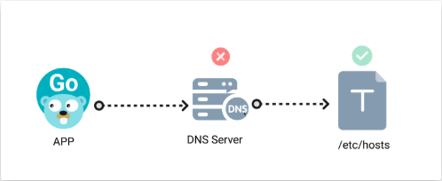

# 网络

没网的人就只能在家里做事，有网可以看网络上其他计算机里面的数据(服务器)

通过网络可以在内部机器发信息 (局域网)，
或者发给外部机器（公网，广域网）。区别是地址不同.

## 实现 (数据分层协议)

> 本质 就是 **两个或多个互联的终端** 间 通过 **中间件/无线** 连接。

### 应用层 (HTTP ,FTP)     [打包快递]
### 传输层 TCP/UDP          [运给快递站]
### 网络层 IP                       [快递站间分拣]
### 链路层 MAC，以太网    [司机拉货到下一个站点]

# 服务器 [应用]

服务器：要有安全属性，限制 哪个机器（IP），发送哪种协议（端口）的数据


## http 协议 [超文本传输协议，多媒体包裹]

通过资源链接[超链接]的形式，客户端 用来向 **服务器** 获取 **多媒体资讯** 的协议[但现在协议的功能被放大，很多游戏，Email，电商也用这个协议展示]。

伯纳斯-李设计 HTTP 是为了推动他的：“万维网”（WorldWideWeb）项目，并且这个目的已经实现了。


所谓幂等，就是该API执行多次和执行一次的结果是完全一样的，没有副作用。


## 流量代理/流量转发

### 系统代理

- 通过设置操作系统的“代理服务器”参数（如HTTP/HTTPS/SOCKS5代理），让浏览器、部分应用等遵循系统代理设置，将流量转发到代理服务器。
- 只对支持代理设置的应用生效
- 不支持命令行工具，系统级流量


### TUN (虚拟网络隧道)

- 通过创建虚拟网卡（TUN、TAP），将指定流量重定向到代理程序
- 可以实现全局代理

# CNAME

CNAME记录的设计目的是让一个域名成为另一个域名的别名。

如果你需要将多个子域名指向不同的目标，你可以为每个子域名设置不同的CNAME记录。例如：

```
www.example.com.  IN  CNAME  example.com.
blog.example.com. IN  CNAME  anotherdomain.com.
```

## 如果你想让多个域名都指向你的 GitHub Pages 站点，你应该：

1. **在 DNS 里配置多个 CNAME/A 记录** 指向 GitHub 的服务器。
2. **`CNAME` 文件中只保留一个“主域名”**，作为 GitHub Pages 的绑定域。

> 例如你可以：
> - DNS 添加：`www.example.com` 和 `alias.example.org` 都指向 GitHub Pages IP 或 `yourusername.github.io`
> - `CNAME` 文件只写：
>   ```
>   www.example.com
>   ```

这样访问 `alias.example.org` 也会跳转到你的站点，或者你通过域名服务商设置 URL 转发。
> ! 注意，因为 github 可以配置多个站点了，所以要在github custom 域名里重新设置


> 历史记录： www	CNAME	cname.vercel-dns.com 

## 域名解析流程



> !  似乎有问题啊？

1. 浏览器访问域名时，首先会查询本地的 hosts 文件，看是否有该域名的解析记录（如有则直接使用）。
2. 如果 hosts 文件没有，则会向本地 DNS 服务器发起查询，DNS 服务器会递归或迭代查询，最终获得域名对应的 IP 地址。
3. 获得 IP 后，浏览器用该 IP 访问服务器。

## hosts 文件/localhost [本地服务器，本地域名解析]

IPv4 地址 127.0.0.1 是本地回环地址，用于设备与自己之间的通信。
对应的 IPv6 地址 是 ::1，是 0:0:0:0:0:0:0:1 的简写形式
>本地测试时，服务器要指定监听 ::1。

# 网络应用

## web 客户端 和 服务器

- web 服务器
    打开 开关后， 不停监控 web 服务端口，并进行分析后 执行相应的 指令。
- web 客户端
    打开 开关后 ，可以发送 不同的 请求，并 接收 反馈信息。

